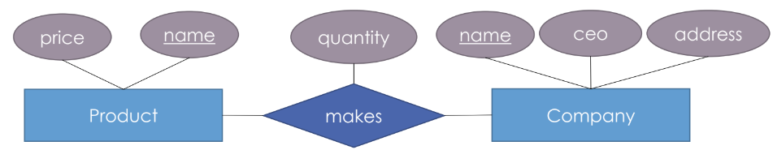
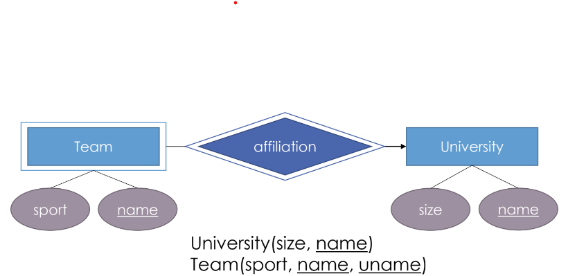
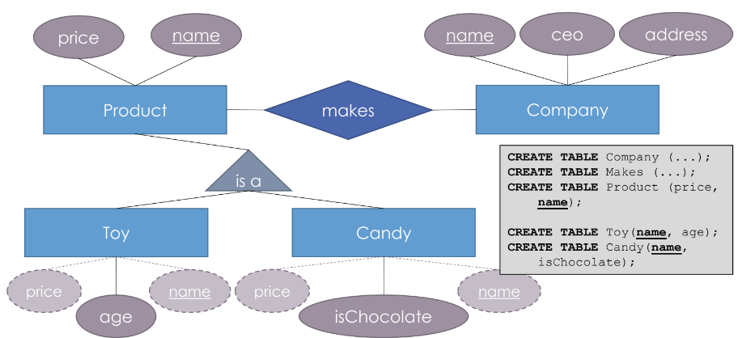
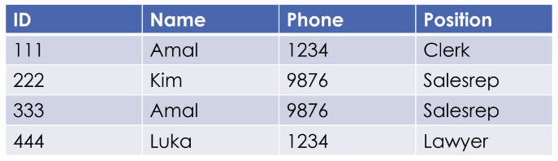
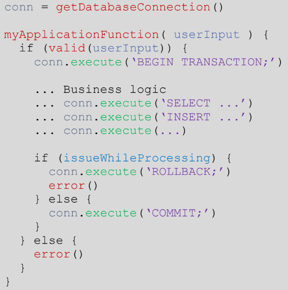
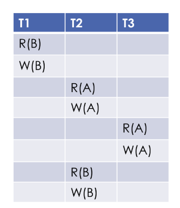
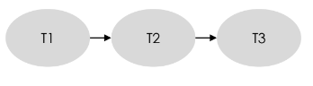

# DataBase Management Systems
DBMS is a big program written by someone else that allows us to manage efficiently a large database and allows it to persist over long periods of time. 
> A Data Model is a mathematical formalism to describe data. It is how we can talk about data conceptually without having to think about implementation.

There are 3 parts in a Data Model.
1. Instance : The actual data rows
2. Schema: A description of what data is being stored.
3. Query Language: How to retrieve or manipulate the data.
## Note
This README file contains only the concepts related to DBMS. All the practice questions are in this [link](https://github.com/nvmcr/Reference_Guide/tree/main/DBMS/PracticeQuestions).

## Table of Contents
1. [SQL](#SQL)
      1. [Intro](#intro)
      2. [SELECT](#select-queries)
      3. [Constraints, Filtering, Sorting](#constraints-filtering-sorting)
      5. [Multiple Table Queries](#multi-table-queries)
      6. [Queries with Expressions](#queries-with-expressions)
      7. [Order of Execution](#order-of-execution)
      8. [Witnessing Problem](#Witnessing-Problem)
      8. [Modifying Rows](#Modifying-Rows)
            1. [Inserting Rows](#inserting-new-rows)
            2. [Updating Rows](#updating-existing-rows)
            3. [Deleting Rows](#deleting-rows)
      9. [Table Queries](#table-queries)
            1. [Creating Tables](#creating-tables)
            2. [Altering Tables](#altering-tables)
            3. [Dropping Tables](#dropping-tables)
      10. [Subqueries](#Subqueries)
            1. [Correlated Subqueries](#Correlated-Subqueries)
      11. [SET Queries](#set-queries)
2. [Database Design](#database-design)
      1. [ER Diagram](#er-diagram)
            1. [Realtionships](#relationships)
            2. [Weak Entity Set](#Weak-Entity-Set)
            3. [Subclassing](#subclassing)
      2. [Backgroud Concepts](#Backgroud-Concepts)
      3. [BCNF](#BCNF)
 3. [Transactions](#Transactions)
      1. [Serializability](#Serializability)
            1. [Serializable Schedules](#Serializable-Schedules)
            2. [Conflicts](#Conflicts)
            3. [Precedence Graph](#Precedence-Graph)
      2. [Lock](#lock)
      
 7. [References](#References)

# SQL
## Intro
Most popular data model is a relational data model. SQL is the query language used.
* What is a relational database? 
> A realtional database represents a collection of tables. For example, an university realtional database might have a table with `StudentId`, `Name`, `YearofPassing`, `GPA` and many other columns. There can be many other *related* tabes in that database. 

Structured Query Language (SQL) is a language designed for users to query, manipulate and transform data from a relational database. Biggest advantage of SQL is that it is efficient and scalable for large and complex databases. Popular SQL databases include: SQLite, MySQL, PostgreSQL, Oracle and Microsoft SQL Server. 

## SELECT Queries
`SELECT` statements are used to retrieve data from a SQL database. These statements are often refered as *queries*.
> A query is just a statement that tells the database what we want. It could be to retrieve, update or modify the data.
Queries have syntax. Say, there is a table named `table1` which has details of students. To retrieve specific columns the qury will look like:
```SQL
SELECT name, gpa
FROM table1;
```
If we need to see the entire table, asterisk (\*) can be used.
```SQL
SELECT *
FROM table1;
```
The `SELECT` and `FROM` statements need not be seperate lines they can be used in a single line too.
```SQL
SELECT year_of_passing, name, gpa FROM table1;
```
> The semi-colan (;) marje the end of a SQL statement similar to C. But in some databased it is optional. SQL is not case sensitive atleast not for keywords. Also it does not require indentation. But its better to use `;` at the end of statements, make keywords capitalized and use indentation for readability.
## Constraints, Filtering, Sorting
What if we don't need all the rows. Just like we *select* required columns, we can retrieve only the required rows using `WHERE` keyword.
```SQL
SELECT name, gpa, year_of_passing
FROM table1
WHERE gpa > 3
      AND year_of_passing >= 2016;
```
We can compare above query with python for loop. `FROM` is analogus to `for`, `WHERE` to `if` and `SELECT` to the operation.
```SQL
for each row in table1:
      if gpa>3:
            print(table1.name, table1.gpa, table1.year)
```
Common operators that can be used include:
|Operator|Example|
|-------|-------|
|=, !=(or)<>, <, >, <=, >=|col_name = 5|
|BETWEEN ... AND ...|col_name BETWEEN 2012 AND 2016|
|NOT BETWEEN ... AND ...|col_name NOT BETWEEN 2012 and 2016|
|IN|col_name IN (1,2,3,4,5)|
|IS NULL, IS NOT NULL|col_name IS NULL|
|LIKE|col_name LIKE 'ME%'|
> `LIKE` is used to filter data based on a specific pattern. It can use wildcard characters like `%` and `_`. `LIKE 'M%'` retrieves every row in that column that **contains** 'M' and `LIKE 'Me_ha'` retrieves every value **strictly** has 'Me' in front and a *single* middle string and 'ha' at the end. Use multiple underscores to retrieve multiple characters. 

> All strings should be represneted within single or double quotations. 
Many times databases are filled with duplicate values. To retrieve only distinct values, `DISTINCT` keyword is used.
```SQL
SELECT DISTINCT gpa, name FROM table1;
```
Also databases agre generally not ordered. To arrange the rows, we can order them by a specific column using `ORDER BY col_name ASC/DESC` clause. ALong with this `LIMIT` and `OFFSET` are commonly used together. 
```SQL
SELECT name, gpa
FROM table1
ORDER BY Id DESC
LIMIT 10 OFFSET 50;
```
After 50 rows, next 10 rows will be returned.
> The `LIMIT` will return the specified number of rows and `OFFSET` will specify where the `LIMIT` count should start from.
## Multi-Table Queries
In real world data, the data is broken down into pieces and stord across multiple orthogonal tables using *normalization*. This database normalization is useful as it minimizes duplicate data in a single table and also allows the data to grow independent of each other. 
For example, if there are two tables `table1` and `table2` where `table1` has `id`, `name`, `gpa` and `table2` has `studentid`, `state`, `city`. If we need top 10 highest gpa students from Texas, query looks like:
```SQL
SELECT name, gpa
FROM table1
  INNER JOIN table2
    ON table1.id = table2.studentid
WHERE state = 'Texas'
ORDER BY gpa
LIMIT 10;
```
`ON` condition specifies how the tables need to be joined. `INNER JOIN`/`JOIN` will join only the rows that are common to both tables. Once the tables are joined, remaining keywords can be used similar to a single table. 
Say we have following query:
```SQL
SELECT t1.name, t2.gpa
FROM table1 AS t1
   JOIN table2 as t2
      ON t1.id = t2.studentid
```
The same query can be implicity written as:
```SQL
SELECT t1.name, t2.gpa
FROM table1 AS t1, table2 AS t2
WHERE t1.id = t2.studentid
```
When we think of above both query in programming sense, the execution looks like:
```SQL
for row1 in table1:
   for row2 in table2:
      if row1.id == row2.studnetid:
         print(row1.name, row2.gpa)
 ```
Similar to `INNER JOIN`, other type of joins can also be used.
> All types of joins combine multiple tables. In specific, `INNER JOIN` will return only the rows that are common to both tables. `OUTER JOIN` will return all the rows from both tables, `LEFT JOIN` will return all rows from first table and will return common rows from second table. `RIGHT JOIN` is the reverse case of LEFT JOIN`. 

Usually joins other than `INNER JOIN` will result in null values. They can be retrieved using `IS/IS NOT NULL` in `WHERE` clause. Also we might need to use self joins too.
Say have a table with name and types of cars and we need to find who all drive mustang **and** ferrari.
```SQL
SELECT t1.name, t2.car
FROM table1 AS t1, table1 AS t2 #Using same table
WHERE t1.name = t2.name AND t1.Car = 'mustang' AND t2.Car = 'ferrari'
```
## Queries with Expressions
Expressions are handy in writing complex logic for querying. The expressions can be combined with all other keywords that we saw before. For example, if we need is to retrieve all students who graduated in even years, the query looks like:
```SQL
SELECT name, year_of_passing
FROM table1
  INNER JOIN table2
    ON table1.id = table2.studentid
WHERE year_of_passing % 2 = 0;
```
Similarly if we can use expressions to transform the data. But for readability we name the transformed column different using `AS` keyword. For example, we need to convert student gpa into 10 point scale, the query looks like:
```SQL
SELECT name, (gpa * 2.5) AS 10_scale_gpa
FROM table1;
```
There are common aggregate functions available such as `COUNT()`, `MIN()`, `MAX()`, `AVG()` and `SUM()`. They can be combined with `GROUP BY` clause too. For example, if we need to find average gpa of students from each state, the query looks like:
```SQL
SELECT State, AVG(gpa) AS Avergae_Gpa
FROM table1
  INNER JOIN table2
    ON table1.id = table2.studentid
GROUP BY State
```

What if we need to apply any transformations on the new column generated after `GROUP BY`? SQL provides another keyword, `HAVING` to use after `GROUP BY`. For example, if we need to find the number of students from each state who graduated in 2022. But we are intrested in the states where total package is more than 100000 the query looks like:
```SQL
SELECT state, COUNT(*) as num_students, SUM(package) as total_package
FROM table1
  INNER JOIN table2
    ON table1.id = table2.studentid
WHERE year_of_graduation = 2022
GROUP BY state
HAVING SUM(package) > 100000;
```
> `HAVING` is only used with aggregate functions. Without aggregate functions `WHERE` can do the job.
## Order of Execution
Below numbering shows order of clauses and keywords executed in a complete query.
1. FROM and JOINs 

These are first executed as we need a table in the first place to work. 

2. WHERE 

Once we have the data, `WHERE` constraints are executed and any needless data is discarded.

3. GROUP BY 

The rows that are left are grouped accordingly. There will be as many rows as there are unique values in the column specified by `GROUP BY`.

4. HAVING 

As expected, it is executed immediately after `GROUP BY`.

5. SELECT

Now specified columns or `ALIAS` specified by `AS` are computed.

6. DISTINCT 

Of the remaining rows,the rows with duplicate values in specified column are discarded.

7. ORDER BY 

The rows are sorted either in ascending or descending order.

8. OFFSET and LIMIT 

What to display is controlled by these two at the end.
## Witnessing Problem
Say we have a table named `Profile` with columns of `UserID`,`Name`,`Job`,`Salary`. Question is: Which person has the highest salary per job? We generally do as
```SQL
SELECT Name, MAX(Salary)
FROM Profile
GROUP BY Job;
```
But this will give error because:
> When using the GROUP BY clause, you should only include columns in the SELECT, HAVING, ORDER BY clauses that are either: * Listed in the GROUP BY clause, or * Are included in an aggregate function like SUM(), AVG(), MIN(), MAX(), or COUNT().

This is because, when we use `GROUP BY Job`, only Job is available in the stack. Asking for `Name` will return error as `Profile.Name is invalid`. 
To solve this, 

1. We will first use self join `FROM Profile AS P1, Profile AS P2 WHERE P1.Job = P2.Job`. This query will return rows with twice the columns with each row having same job in both P1.Job and P2.Job column. 
2. Since we need max salary per job, we can refer P2 as `SELECT MAX(P2.Salary) ... GROUP BY P2.Job`.
3. We need to return names so we can `P1.Name` in the GROUP BY. 
4. Now we grouped with P1.Name and P2.Job but the output will have all salaries not just max in each job. So we can add `HAVING P1.salary = MAX(P2.Salary)`.
5. Final query looks like:
```SQL
SELECT P1.Name, P2.Job, MAX(P2.Salary)
FROM Payroll AS P1,
   Payroll AS P2
WHERE P1.Job = P2.Job
GROUP BY P1.Name, P1.Salary, P2.Job
   HAVING P1.Salary = MAX(P2.Salary);
```
Following steps can be followed to solve witnessing problems 
1. Start with a self-join
2. Identify the group and the per-group aggregation fn
3. Join the original tables on the grouping attribute(s)
4. Also group on the (original) argument’s attribute
5. Remove the groups whose values don’t match the new aggregated argument
6. Select the argument and its aggregated value
## Modifying Rows
*Schema* makes a SQL database efficient and consistent even with large amounts of data.
>The database schema describes the structure of each table and the datatypes that each column contain.
### Inserting New Rows
We use `INSERT INTO` statement to specify the table we are modifying and use `VALUES` to specify values. Say, we need to add two new rows to our student table that has columns `Id`,`Name`,`Gpa`, the query looks like;
```SQL
INSERT INTO table1
VALUES
      (20, "Megha",3.94),
      (21, "Macha",3.96);
```
We need to specify all the column values in our new row. If we have incomplete rows to be added in a table that support default values, we can explicitly mention.
```SQL
INSERT INTO table1 (Name,Gpa)
VALUES
      ("Megha", 3.94)
      ("Macha",3.96)
```
We can even specify value in form an equation like `("Megha",3.94*2.5)`.
### Updating Existing Rows
To update alreaday existing rows in the table, we use `UPDATE` and `SET`. In most cases, updating rows will also include `WHERE` to specify row as we dont want to update entire columns. Say we have a table with year of passing and package columns and we want increase package by 1000 and decrease gpa by 10% for all students graduated after 2020.
```SQL
UPDATE table1
SET package = package + 1000, gpa = gpa*0.1
WHERE year > 2020;
```
### Deleting Rows
To delete the rows in a table, we use `DELETE FROM`. Using this clause without a `WHERE` statement will clear all the rows.
```SQL
DELETE FROM table1
WHERE Gpa < 3;
```
> Before updating or deleting, its better to use `SELECT` statement first to check if we are updating/deleting the correct row.
## Table Queries
### Creating Tables
We create tables using `CREATE TABLE` statement. The syntax looks like:
```SQL
CREATE TABLE IF NOT EXISTS tableName (
      columnName1 datatype constraints DEFAULT default_value,
      columnName2 datatype
      );
```
`IF NOT EXISTS` is an optional clause just to check if there is any other table with same name. If column name needs ro be seperated by spaces, enclose it in square brackets or quotation marks. 
Common Data Types include;
|Data Type|Description|
|--|--|
|INT/INTEGER|A signed or unsigned 32bit(depends on database) integer|
|BIGINT|A large integer (1000000)|
|BOOL/BOOLEAN|True/False or 1/0|
|FLOAT|A decimal value|
|DOUBLE|A large decimal value|
|CHAR/CHARACTER(num_char)|String types with fixed length. If input < num_char, extra space is filled with spaces|
|VARCHAR(num_char)|String type with variable length. `num_char` is just a max cap.|
|DATE|Common format includes YYYY-MM-DD|
|TIME|Common format includes HH:MM:SS|
|DATETIME|Mix of date and time, YYYY-MM-DD HH:MM:SS|
|INTERVAL|It stores time difference/interval like 3 hours/5days and 2 hours|
|YEAR/MONTH/DAY|Individual representation|
|BLOB|Binary Large Object store large binary data. They are ususally images, videos that can be queried with right metadata| 

Along with the mandatory datatype, a column can also have an optional constraint that limits what values can be inserted into a column. 
Commonly used constraints are:
|Constraint|Description|
|--|--|
|PRIMARY KEY|Each value in this column is unique and cant have NULL values. They can be used to identify each row (~id)|
|FOREIGN KEY|This establishes relationship between tables. Say there is a master table and a additional table, the ids in additional table are FORIEGN KEY and they should match with PRIMARY KEY in master table|
|AUTOINCREMENT|Integer values are automatically incremented and filled with each row insertion (Not supported by all database|
|UNIQUE|Ensures all values in that column are unique|
|NOT NULL|The column cant have NULL values|
|DEFAULT|A default value if no value is specified|
|CHECK (expression)|Custom expression to have a specific value in column `CHECK (gpa>0 AND gpa<4)`| 

Example:
```SQL
CREATE TABLE table1 (
      id INT PRIMARY KEY AUTOINCREMENT,
      name VARCHAR(50),
      gpa DECIMAL(10,2) CHECK (gpa > 0 AND gpa<4),
      package FLOAT DEFAULT 30000,
);
```
We can even make two columns into a primary key by specificying primary key seperately like `PRIMARY KEY (id, name)`.
Foreign key query looks like:
```SQL
CREATE TABLE table2 (
      id INT,
      name VARCHAR(50),
      year DATE,
      FOREIGN KEY (id) REFERENCES table1(id)
);
```
We cannot use a foreign key **without references**.
### Altering Tables
Altering a table maybe to add new columns, removing existing columns or renaming the table.
```SQL
ALTER TABLE table1
ADD year_of_passing INT;
```
```SQL
ALTER TABLE table1
DROP year_of_passing;
```
```SQL
ALTER TABLE table1
RENAME TO table2;
```
There are additional features provided by specific databases. For example, MySQL provides `FIRST` or `AFTER` keywords for insertion of columns.
### Dropping Tables
```SQL
DROP TABLE IF EXISTS table1;
```
`DELETE` without a `WHERE` will also remove all the rows which is nothing but deleting entire table.
> If there is a `FOREIGN KEY` depending on the table that is to be deleted, first all those dependent tables need to be updated.
## Subqueries
Subqueries, also known as nested queries, are a powerful feature in SQL that allow you to write complex queries by embedding one query inside another. 
> A subquery is a SELECT statement that is embedded within another SELECT, INSERT, UPDATE, or DELETE statement. 
The result of the subquery is then used as a value or a condition in the outer query. Subqueries are *enclosed in parantheses*. Will look at different ways to use subqueries. 
For example, we have two tables `students` and `parttimeEmployees`. We need to find out the students who are also part time employees.
```SQL
SELECT * 
FROM students
WHERE StudentName IN (SELECT EmployeeName FROM parttimeEmployees);
```
Another example would be, say we need to update all gpa by 10% for all those who have gpa less than average gpa.
```SQL
UPDATE students
SET gpa = gpa*1.1
WHERE gpa < (SELECT AVG(gpa) FROM students);
```
### Correlated Subqueries
A correlated subquery is a type of subquery that relies on the outerquery for its values.
> The key difference between a subquery and a correlated subquery is that a subquery is executed independently and its result is used by the outer query, while a correlated subquery is executed for each row of the outer query and its result depends on the values of the outer query.
For example, we need to find average gpa of students from each state where the average gpa is lower than the overall average gpa from all states. The states information is located in a different table. The correlated subquery looks like
```SQL
SELECT State, AVG(gpa) AS avg_gpa
FROM table1
  INNER JOIN table2
    ON table1.id = table2.studentid
GROUP BY State
HAVING AVG(gpa) < (
      SELECT AVG(gpa)
      FROM table1
      WHERE id = table2.studentid
      );
```
In the above example, the subquery is calculating the total average gpa and is using `id` from main query making it correlated subquery.
>Generally, correlated subqueries are realted to main queries using `WHERE` statement.
## SET Queries
There are few set operations available to append one results of different queries. 

The `UNION` operator combines results from two or more `SELECT` statements into a single results set that includes all distinct rows returned by either `SELECT` statements. `UNION ALL` will return all rows without considering whether they are distinct or not. 

The `INTERSECT` operator returns only the common rows returned by `SELECT` two statements. 

The `EXCEPT` operator returns all rows returned by first `SELECT` and that are not present in second `SELECT`.
```SQL
SELECT col1, col2
FROM table1
UNION/UNION ALL/ INTERSECT/ EXCEPT
SELECT col1, col2
FROM table2
```

# Database Design
Database design or logical design or relational schema design organises data by considering what data needs to be stored and the relationship with the data. In simple terms, say we have arbitary data like csv files, text, images etc.. database design is about organising this data efficiently so that others can easily look up this data with queries.
## ER Diagram
To conceptualize our database design, we use Entity Relationship diagrams. They are similar to flowcharts explain relationship between the data entities. Blocks in ER diagram includes


Think about an entity set like a class. Say we have a enity set (class) called Person which is a table. It has attributes (field) like name, address etc which are columns and each attributes will have entity (object) which is the actual piece of the data like Bob, Seattle etc.
> In the ER diagram, attribute with an underline means its the primary key of the entity set/table. 
### Relationships
Most of the tables in the database are related to one another, that's the point of placing them in the same database. A relation is a subset of two entities. We can have atrributes to the relationships too.



The realtionships can be one-to-one (with arrows on both side of relation), many-to-one (arrow only on the right) and many-to-many(no arrows). We create a seperate table to show the relationships between entity sets using foreign keys. We can create a one-to-one mapping using `UNIQUE`.
### Weak Entity Set
The entity that can not exist without another entity. It has a key from strong entity set. For example, a sports team wouldn't exist if the university that the team belongs doesn't exist. In an ER diagram the weak entity set and its relation is represented with double rectangle and double diamond respectively.


### Subclassing
Similar to object oriented programmin concept of subclass, an entity can have a subclass. This sublass inherits all attributes and relationships of parentclass and also can have its own attributes and relationships. When creating a subclass, we don't have to explicitly mention the attributes and realtionships of the superclass. We can just give the primary key of parentclass 


## Backgroud Concepts
When building a database, we have to avoid:
* Redundant Rows with repeated values
* Unrelated columns in same table

To avoid these we seperate unrelated columns. To seperate columns, we need to identify the realtion among the columns. In a table, there might be some columns that determine other columns (functional dependency).



In the above table, we can see `ID` implies Name, Phone and position i.e every unique ID has an unique Name, position and phone associated with it. Similarly every unique position has an unique phone asscoiated with it. But unique phone doesn't imply unique position. Set of all columns/attributes that can uniquely identify all attributes are called **superkey**. For example, set of ID and email address could be superkey. If superkey cannot be broken down further then it is called minimal superkey. In above example, ID and email address individually are minimal superkeys but combination of both is not.
## BCNF
If there are any functional dependency such that `X implies A`, then X must be a superkey. This way we can reduce redundancy. If there is any violation, then decompose the table such that X should be a superkey in one of the splitted table.


In the above primary table, we can see that ID implies Name and Parking Lot but not Car which makes ID not a superkey. So we decompose the table based on the dependency. This is called Boyce-Codd normal form (BCNF). There are many other normal forms available like 1NF, 2NF,3NF,4NF. 1NF/ first normal form specifies that table must be *flat* and have a primary key i.e every column of the table should be atomic (values cannot be further divided) and every row should be unique (combination of all column values in that row is unique not individual value in a single column) and identifiable using primary key. For example a value like `Oranges, Grapes` is a violation of atomicity as value can be broken down to `Orange` and `Grapes`. So the column of these fruits are decomposed into seperate table with same primary key.
# Transactions
Say we are transferring money from one account to another. The bank's list of operations involve begin transaction session, check account balance and details, deduct funds in first account, add funds in second account and end the transaction. Imagine we are doing these operations in steps of sql commands whose execution happens linearly step by step. What if there is any error in adding funds to second account? But the before step of deducting amount is executed. To prevent issues like these, we need to execute all the list operations as a single operation. A transaction ensures all database operations (insert, delete,..) are executed as a single, whole operation.
> A transaction refers to a logical unit of work that performs one or more database operations as a single, indivisible unit of work.

Characteristics of transactions are:

1. Atomicity

It ensures that all operations within a transaction are executed(commited) or none of them are executed(rolled back). It describes an operation's encapsulation.

2. Consistency

It ensures that the database remains in a consistent state before and after the transaction.

3. Isolation

It ensures that multiple transactions can execute concurrently without interfering with each other's work.

4. Durability

It ensures that the effects of a committed transaction are permanent and survive system failures.

Often times, there are tradeoff between each of these features. But in serious applications like banking, healthcare all ACID properties are essential. Example of a transaction:



Schedules are a sequence of operations (like read and write) performed by transactions on a database. A schedule specifies the order in which transanctions execute their operations. Let's say that a DBMS is being used to manage inventory for an e-commerce store. The store has multiple users accessing and modifying the inventory database at the same time. Here is an example of a schedule:
|Transaction|Operation|Item ID|Quantity|
|---|---|---|---|
|T1|Write|Item A|100|
|T2|Read|Item A|-|
|T1|Read|Item B|-|
|T2|Write|Item B|50|
|T1|Write|Item C|75|

In this example, transaction T1 performs write operations on items A and C and a read operation on item B. Transaction T2 performs read operations on item A and a write operation on item B. The operations are executed in the order shown in the schedule.

Assuming that the initial inventory quantities for items A, B, and C are 50, 75, and 100 respectively, the schedule updates the inventory as follows:

* Item A: T1 adds 100, and T2 reads 100.
* Item B: T1 reads 75, and T2 updates the quantity to 50.
* Item C: T1 updates the quantity to 75.

Note that the operations in the schedule are executed concurrently, but the order of the operations is important to ensure that the inventory remains consistent and correct. Scheduling algorithms are used to control the order of operations to ensure that the data remains consistent and the inventory quantities are updated correctly.
## Serializability
A serial schedule is a schedule in which transactions are executed one after the other, with no overlapping operations. In other words, each transaction is executed in its entirety before the next transaction begins. This ensures that the transactions do not interfere with each other, and the database remains in a consistent state.

Here is an example of a serial schedule:

|Transaction|Operation|Item ID|Quantity|
|--|--|--|--|
|T1|Read|Item A|-|
|T1|Write|Item B|50|
|T1|Write|Item C|75|
|T2|Read|Item A|-|
|T2|Write|Item B|100|
|T2|Write|Item C|125|

The transactions are executed in a serial order, with T1 completing its operations before T2 begins or T2 executing first and then T2 is also legal serial schedule. This ensures that the transactions do not interfere with each other and that the database remains in a consistent state.

A serial schedule is simple and easy to implement, but it may not be optimal for performance in a multi-user environment. In a serial schedule, transactions have to wait for other transactions to finish, which can result in long waiting times and reduced throughput.
### Serializable Schedules
It is a schedule that produces the same result as a serial schedule, even though the transactions may execute concurrently. In other words, a serializable schedule ensures that the outcome of concurrent transactions is equivalent to the outcome of executing the same transactions serially. A serializable schedule can be used to optimize database performance by allowing transactions to execute concurrently, which can improve throughput and reduce waiting times.

### Conflicts
A conflict occurs when two or more transactions attempt to access the same data item at the same time, and at least one of the transactions modifies the data. There are three types of conflicts that can occur when transactions execute concurrently: read-write conflict, write-write conflict, and write-read conflict.
1. Write-Write Conflict:

A write-write conflict occurs when two transactions write to the same data item. This type of conflict occurs when two transactions update the same data item, resulting in an inconsistent value. Consider below example of a serial schedule.

|Transaction|Operation|
|--|--|
|T1|Set Account1 = 200|
|T1|Set Account2 = 0|
|T2|Set Account2 = 200|
|T2|Set Account1 = 0|

Final state is Account1 = 0 and Account2 = 200. This doesn't have any conflicts as it is serial schedule. Now consider this:

|Transaction|Operation|
|--|--|
|T1|Set Account1 = 200|
|T2|Set Account2 = 200|
|T1|Set Account2 = 0|
|T2|Set Account1 = 0|

Final state is Account1 = 0 and Account2 = 0. This is the write-write conflict or **Lost Update**.

2. Write-Read Conflict:

A write-read conflict occurs when one transaction writes to a data item and another transaction reads from the same data item. This type of conflict occurs when a transaction reads a value from a data item that has been modified by another transaction, but has not yet been committed to the database.

For example, consider two transactions T1 and T2. T1 writes a new value to x, while T2 reads the old value of x before T1 completes. In this case, T2's read operation is inconsistent with the new value of x, which results in a write-read conflict. Something like checking an account balance in middle of a bank transaction. This is also called **Dirty Read**.

3. Read-Write Conflict

A read-write conflict occurs when one transaction reads a data item and another transaction writes to the same data item. This type of conflict occurs when a transaction reads a value from a data item that has been changed by another transaction before the first transaction has completed.

For example, consider two transactions T1 done by user 1 and T2 done by user 2. T1 reads the value of x, while T2 writes a new value to x before T1 completes. In this case, T1's read operation is inconsistent with the new value of x, which results in a read-write conflict. Something like updaing an account while checking the balance. This is also called **Phantom Read**.

One can reorder transactions that doesn't have any conflicts as mentioned above. For example, lets say we have following schedule:
|Transaction|Operation|
|--|--|
|T1|Read Account1|
|T1|Write Account1|
|T2|Read Account2|
|T2|Write Account2|

This table can be made conflict serializable schedule as follows:
|Transaction|Operation|
|--|--|
|T1|Read Account1|
|T2|Read Account2|
|T1|Write Account1|
|T2|Write Account2|

A conflict serializable schedule is a schedule in which transactions do not conflict with each other. To make a conflict serializable schedule we can not change orders of following transactions of same account: Write-Write, Write-Read and Read-Write. 
### Precedence Graph
Say we were given a schedule of transactions and we need to find if they can be reorder as conflict serializable. A precedence graph will help us if it is possible to do.

In a precedence graph, each node represents a transaction in the schedule, and a directed edge is drawn between two nodes if there is a conflict between the operations of those transactions. Take a look at below schedule.



For this schedule, precedence graph looks like:



There is a direct edge between T1 and T2 because there is a conflict with B. There is a direct edge between T2 and T3 as there is a conflict with A. If there is a loop in the graph (cycle), then the schedule can not be reorder as conflict serializable.

## Lock
The **concurrency control scheduler** is responsible for ensuring that multiple transactions executing concurrently do not interfere with each other, and that the consistency of the database is maintained. Pessimistic/Locking scheduler and optimistic/multi-version concurrency control are two approaches to managing concurrent access to data in a database.

Optimistic concurrency control assumes that conflicts between transactions are rare, and takes an optimistic approach to concurrency. It does not use locks to prevent concurrent access to data, instead allowing multiple transactions to access the same data simultaneously. Main idea is to execute transaction first and then check while commiting. We are more intrested in other concurrency control.

Pessimistic concurrency control assumes that conflicts between transactions are likely to occur, and takes a cautious approach to concurrency. It uses locking mechanisms to prevent concurrent access to data, ensuring that only one transaction can access a particular data item at a time. For a database element, a transaction must acquire a lock before reading or writing to the data element. Once a txn is done with that element, it releases the lock. If another transaction wants to access a data element, it should wait for that element to be releases from lock.


# References
1. [SQLBolt](https://sqlbolt.com/)
2. [CSE 414 UW](https://sites.google.com/cs.washington.edu/cse414-23sp/home)
3. [Ace the Data Science Interview](https://www.acethedatascienceinterview.com/)
4. ChatGPT :)
