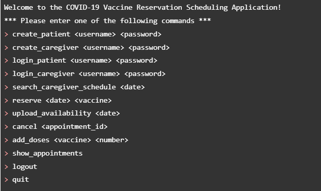

# Python Application for Vaccine Scheduler

## Configure your database connection
### Installing dependencies and anaconda
Our application relies on a few dependencies and external packages. You’ll need to install those dependencies to use this.

We will be using Python SQL Driver pymssql to allow our Python application to connect to an Azure database. We recommend using Anaconda for completing this.

Mac users, follow the instructions in the link to install Anaconda on macOS: https://docs.anaconda.com/anaconda/install/mac-os/

Windows users, follow the instructions in the link to install Anaconda on Windows: https://docs.anaconda.com/anaconda/install/windows/. You can choose to install Pycharm for Anaconda, but we recommend installing Anaconda without PyCharm as we will be using the terminal.

After installing Anaconda:

We first need to create a development environment in conda.
macOS users: launch terminal and navigate to your source directory.
Windows users: launch “Anaconda Prompt” and navigate to your source directory.

Follow the steps here to create an environment. Make sure you remember the name of your environment.
Run: conda create -n [environment name]

Activate your environment following the steps here. 
Run: conda activate [environment name]

To deactivate, Run: conda deactivate
Run “conda install pymssql” to install the dependencies.

### Setting up credentials
The first step is to retrieve the information to connect to your Microsoft Azure Database.
The Server and DB names can be found in the Azure portal. 
The server name would be “data514server.database.windows.net”. However, for step 2.3.3 Setting up environment variables, you’ll only need to put in the phrase before “.database.windows.net”. In the screenshot below, it would be just “data514server” for the server in step 2.3.3 Setting up environment variables. 
The database name would be “data514db” for the database shown in the screenshot below. 
YOU NEED TO CHANGE THIS ACCORDING TO YOUR DATABASE!
The User ID would be of the format <user id>@<server name> 
For example, it could be exampleUser@data514server where “exampleUser” is the login ID which you used to log in to query editor on Azure and “data514server” is the server name.
Password is what you used to log in to your query editor on the Azure portal.
If you’re having trouble finding that information, please make a discussion post, or contact us through email!

Once you’ve retrieved the credentials needed, you can set up your environment variables. 

 ### Setting up environment variables 
Make sure to set this in the environment you created if you’re using virtual environments! Remember, to go into the environment you created, you’ll need to activate it. 
In your terminal or Anaconda Prompt, type the following:

  conda env config vars set Server={}

  conda env config vars set DBName={}

  conda env config vars set UserID={}

  conda env config vars set Password={}

Where “{}” is replaced by the respective information you retrieved from step.

  You will need to reactivate your environment after that with just the command “conda activate [environment name]”. Don’t do conda deactivate before this
### Working with the connection manager
In scheduler.db.ConnectionManager.py, we have defined a wrapper class to help you instantiate the connection to your SQL Server database. You’ll need to run this document to connect to your database: Run “python ConnectionManager.py”. 
We recommend reading about pymssql Connection and Cursor classes for retrieving and updating information in your database.
Here’s an example of using ConnectionManager.
# instantiating a connection manager class and cursor
cm = ConnectionManager()
conn = cm.create_connection()
cursor = conn.cursor()

## Verify your setup
Once you’re done with everything, try to run the program and you should see the following output. You should be running the program in terminal (macOS) or Anaconda Prompt (Windows) and in your conda environment. 
  
Note: Command to run the program: “python Scheduler.py” or “python3 Scheduler.py”.

