# Deep Learning
Deep learning algorithms are inspired by the structure and function of the human brain, allowing machines to learn from vast amounts of data, recognize patterns, and make accurate predictions. From image and speech recognition to natural language processing and autonomous vehicles, deep learning is everywhere these days. I will try to cover the most talked about topics in this chapter.
# Loss Function
As discussed vastly in [Machine Learning chapter](https://github.com/nvmcr/DataScience_HandBook/tree/main/Machine_Learning), a loss function is something that tells us how well our model is working. In deep learning, we will most look into classification cases. Multiclass SVM (also called hinge loss) and Softmax Loss.
## Multiclass SVM
It is the same loss function used in SVMs for multi-class classification. Say we have a classifier and scores vector is, $s=f(x_i, W), then the loss is given as:

$$ L_i = \Sigma_{j\neq y_i} max(0, s_j-s_{y_i}+1) $$

Here $y_i$ is the correct label. The main aim of this loss function is to have the highest score in $s_{y_i}$. If it doesn't have the highest scores, loss is given as the difference between an actual class score and sum of all other classes scores.

Ex: Say we have a *cat* image and our scores vector looks like this:

|Class|Score|
|---|--|
|cat|3.2|
|car|5.1|
|frog|-1.7|

The loss is calculated as $max(0, 5.1-3.2+1) + max(0, -1.7-3.2+1) = 2.9$ Loss is calculated for the classes other than the actual class.

We generally added regularization like L1 or L2 to the loss function.

## Softmax Loss
Scores given by hinge loss don't mean much. Those are just some arbitrary values. But softmax loss given scores as probabilities for better interpretation. 

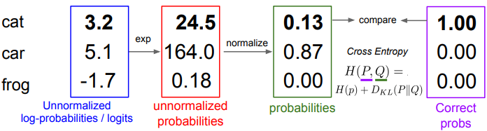

Same as before we have scores like 3.2 for cat. This is passed through an exponential function and then is normalized by the sum of the exponential value of all classes. This exponential and normalizing is called softmax function, $P(Y=k|X=x_i) = \frac{e^{s_k}}{\Sigma_j e^{s_j}}$. The final loss is given by $L_i=-logP(Y=y_i|X=x_i)$ which is nothing but doing cross-entropy loss for a softmax function. 

In general, people call this loss as cross-entropy loss too. But it is actually cross-entropy loss for a softmax function.
# Optimizer
Using the loss function we get to know how our model is working. But to make our loss less or make our model work well we have to optimize our weights. Optimizers are the functions used to optimize our weights. We already discussed gradient descent(GD) and its variants in machine learning chapter. So we will discussed few advanced optimizers here.

## GD Pitfalls
Not all convex functions are good for GD. There are non-smooth functions that have sharp corners where function is not differentiable.
> The derivative of a function at a point is defined as the slope of the tangent line to the function at that point.

A subgradient is the gradient at a point on the function. At the sharp corners, there can be multiple tangents leading to multiple subgradients at a single point. This makes convergence go crazy.

Other two main challenges with Gradient Descent are local minima's, saddle points and plateau. 

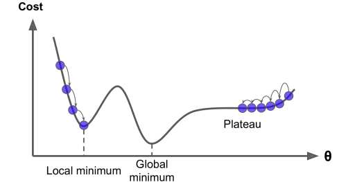

If the random initialization starts the algorithm on the left, then it will converge to a local minimum, which is not as good as the global minimum. If it starts on the right, then it will take a very long time to cross the plateau (flat regions), and if you stop too early you will never reach the global minimum. 

Saddle points are not local minima. They are the points where in one direction loss goes up and in other loss goes down making gradient at the point zero. But the point is not local or global minima. Our GD can't get out of saddle point regions.

Most of these pitfalls are common for deep learning models as we have large number of dimensions involved in optimization. So most of the below discussed optimizations are used in deep learning.
## SGD with Momentum
This is a technique used to accelerate the convergence of the optimization process by adding a fraction of the previous gradient to the current gradient estimate. The idea is to allow the optimization algorithm to build up speed in directions that have consistent gradients and to dampen oscillations in directions with inconsistent gradients thus passing local minima with velocity gathered from rolling down the hill. Similarly crossing saddle points and plateaus (flat regions).

Specifically, at each iteration of the SGD algorithm with momentum, the gradient is computed on a small subset of the training data (a mini-batch), and then a "velocity" vector is updated by adding a fraction (the momentum coefficient or $\rho$) of the previous velocity vector to the current gradient estimate. The parameters of the model are then updated by subtracting the updated velocity vector from the current parameter estimate.

The momentum coefficient is typically set to a value between 0 and 1, usually 0.9 with higher values leading to more momentum and faster convergence, but potentially overshooting the optimal solution.

for t=1,...T do

  for i=1,...n do

$v \leftarrow = \rho v + (y^i - w^Tx^i)x^i$

$w \leftarrow w + \alpha v$

return w

But, we observe we have two hyperparameters now, $\rho$ and $\alpha$. They need tuning to get the best results.

Nesterov momentum is an extension of the standard momentum optimization algorithm. It improves upon traditional momentum by taking into account the expected future position of the parameters when computing the gradient update. This helps to accelerate convergence and enhance the optimization process.

Standard momentum update involves two steps: 1) calculating the momentum term by accumulating a fraction of the previous update, and 2) updating the parameters based on this momentum term. Nesterov momentum modifies the second step to incorporate a look-ahead update, which allows the algorithm to "look ahead" and make a more informed gradient update.
## AdaGrad
AdaGrad, which stands for Adaptive Gradient, is an optimization algorithm that is designed to automatically adapt the learning rate during training. 

During training, AdaGrad maintains a set of per-parameter gradient accumulators, which are initialized to zero. At each iteration, the gradient of the loss function with respect to the parameters is computed, and the accumulated sum of the squared gradients for each parameter is updated as follows: $grad accumulator += gradient^2$. The parameter is calculated as:

$$ parameter -= \frac{initial learning rate}{\sqrt{grad accumulator} + offset to avoid zero}* gradient $$

The negative sign is turned into positive by the gradient (negative gradient means going down the slope). The initial learning rate is generally set to 0.1 or 0.01 but it doesn't matter because it is adaptively scaled. Adagrad even address issue in higher dimensional space where one parameter converges faster than the other.

In Adagrad, as the gradient decreases, the step size keeps decreasing as we approach convergence which is useful in convex but if there is a saddle point or flat, then the optimization becomes super slow.
## RMSProp
This is an updated version of Adagrad.

$$ grad acc = decay rate * grad acc + (1 - decay rate) * gradient^2 $$

$$ parameter -= \frac{initial learning rate}{\sqrt{grad accumulator} + offset to avoid zero}* gradient $$

The first line of the update rule computes the moving average of the squared gradients using an exponential decay, which is a hyper-parameter usually set to 0.9. This effectively scales down the learning rate for parameters with large gradients and scales up the learning rate for parameters with small gradients. Thus giving us smoother convergence.
## Adam
Perhaps the most used optimizer for neural networks. Adam, short for Adaptive Moment Estimation, is a popular optimization algorithm in machine learning that combines ideas from both RMSprop and momentum-based gradient descent. It is an adaptive learning rate optimization algorithm, which means it adjusts the learning rate of each parameter based on the history of the gradients for that parameter. 

The Adam algorithm maintains a set of exponentially decaying average of past gradients and past squared gradients for each parameter. The decaying rate of the averages is controlled by two hyperparameters, $\beta_1$ and $\beta_2$, which are typically set to 0.9 and 0.999, respectively. The average of past gradients is used to calculate the momentum term, while the average of past squared gradients is used to calculate the scaling term. These two terms are then combined to obtain the update for each parameter.

Say the computed gradient of loss function be $dx$ and first and second moment are set to zero initially.

$$ first moment = \beta_1\*first moment + (1-\beta_1)\*dx $$

$$ second moment = \beta_2\*second moment + (1-\beta_2)\*dx\*dx $$

$$ parameter -= \frac{\alpha*first moment}{\sqrt{second moment} + offset} $$

Adam also includes a bias correction mechanism that corrects for the fact that the estimates of the first and second moments are biased towards zero, especially in the early stages of training when the estimates are very inaccurate.

*Adam with weight decay (L2 regularization) should be the default choice for most of the problems.*
# Neural Networks
Let's consider a supervised image classification. Using a linear classifier is not enough for images as they don't capture more than one template. It's important that we use a nonlinear classifier. For many years in the field of computer vision, people tried different approaches to extract/learn features of images using techniques like Histogram of Oriented Gradients (HOG), Bag of Words, etc. But most of them are not effective except neural networks. 

Neural networks are a bunch of linear classifiers with activation functions in between. Activation functions are nonlinear functions that add nonlinearity and help the model learn complex relations. Without these, the neural network is just a linear classifier. 

In a neural network, there is an input layer, an output layer, and any number of hidden layers in between. Each hidden layer consists of neurons. We try to learn the weights/parameters of these neurons. See the below image to know what happens in a fully connected neural network/multi-layer perception. 

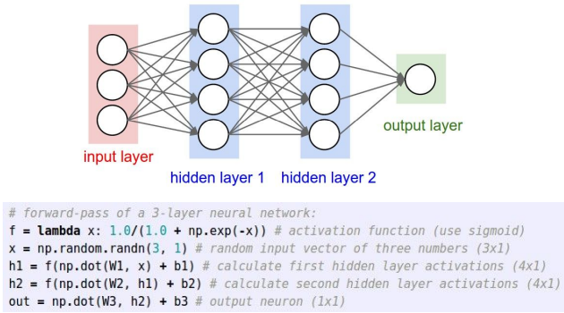

Each input is multiplied (dot product) by the weight of each neuron. This dot product is made nonlinear by passing through the activation function. This output of one hidden layer is passed as the input to the next hidden layer. Each hidden layer will have a bias term just as we have in any other model. (Bias term is to have the offset/intercept as not every function is symmetrical around the origin). The more neurons and layers the more powerful the network is but beware of overfitting and use regularization effectively. 
## BackPropagation
In order to optimize, if we use gradient descent for neural networks, then we have to derive the gradient for weight matrices of each layer, and computing gradients become too complex. The better idea is to use the technique called backpropagation. Watch the [video](https://youtu.be/Ilg3gGewQ5U) by 3Blue1Brown for a visual understanding of backpropagation. Let's see the mathematical implementation of backpropagation.

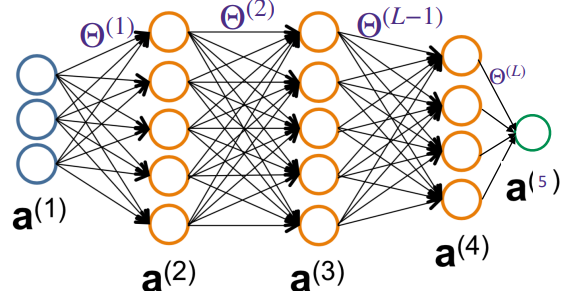

Here we have a fully connected 3-layer neural network with layers represented with $a^{layer_num}$, input later being $a^1$, the last hidden layer is $a^l$ and the output layer is $a^{l+1} and weight matrix of layer $l$ are represented as $\theta^{l-1}$. The weight and biases are randomly initialized. The input $x$ is a single sample image from our dataset.

In the forward pass,

$$ a^1 = x $$

$$ z^2 = \theta^1 a^1 $$ 

$$ a^2 = g(z^2) $$ 

$$ a^l = g(z^l) $$

$$ z^{l+1} = \theta^l a^l $$

$$ a^{l+1} = g(z^{l+1}) = \hat{y}$$

where $g(z) = \frac{1}{1+e^{-z}} $$ which is a sigmoid activation function. 

Backpropagation:

We will chose loss function as a categorical cross entropy $L(y,\hat{y}) = ylog(\hat{y}) + (1-y)log(1-\hat{y})$. We need to optimize the weights and biases. For now, I am removing bias terms as it is handled in the same way as weights. To know in which direction the weights should move, we do gradients. So in the backward pass, we have to find $\frac{\partial L(y,\hat{y})}{\partial \theta_{i,j}^l}$. We start computing gradients of the last layer first and then keep moving back layers. This is an efficient way as we can use the computed gradients of this layer in the previous layer. We will see an example of this. Say we need to compute how the loss changes based on the last hidden layer,

$$ \frac{\partial L}{\partial \theta^{l-1}} $$

(Note: I am taking the entire weight matrix here but it is actually computed for each neuron of the layer, $\theta_1^{l-1}$) 

This is where the chain rule helps. The chain rule says that we can calculate the effect of changing something can be expressed as multiplying changes done along the way. So we can break down the derivative as inner functions using chain rule. As $z^l = \theta^{l-1} a^{l-1}$, changing the weight will also change $z^l$. Again $a^l = g(z^l)$ so changing $z^l$ will change $a^l$. Thus

$$ \frac{\partial L}{\partial \theta^{l-1}} = \frac{\partial z^l}{partial \theta^{l-1}} \frac{\partial a^l}{\partial z^l} \frac{\partial L}{\partial a^l} $$

$$ = a^{l-1} g'(z^l) L'(a^l) $$

Not doing explicit calculations as that is not our focus here. We do similarly for the bias term. The result of the bias term is almost the same as above except for the first inner function after using chain rule. So we have the gradient equations for last layer weight and biases so that we can use them in gradient descent to find optimal values. Now we go to the previous layer. Here we need to calculate,

$$ \frac{\partial L}{\partial \theta^{l-2}} = \frac{\partial z^{l-1}}{\partial \theta^{l-2}} \frac{\partial a^{l-1}}{\partial z^{l-1}} \frac{\partial z^l}{\partial a^{l-1}} \frac{\partial a^l}{\partial z^l} \frac{\partial L}{\partial a^l} $$

We can see that to calculate the gradients for this l-1 layer, we need gradients from the last layer too which we already calculated (so we start from back instead of first layer). Thus we move backward calculating each layer gradients till we reach the first layer and do gradient descent to get the updated values for weights and biases for the next forward pass.

When using PyTorch or TensorFlow all these local gradients (gradients within the hidden layers) are calculated automatically using auto differentiation. So we need not explicitly calculate all the gradients. But remember that these gradients occupy space within the memory as there will be thousands of parameters in a neural network. If you are getting CUDA out of memory, it's probably because gradients are occupying the memory. 

## Convolutional Neural Network
FCNs are computationally too expensive as they take the entire image by flattening it (32x32x3) and that was one of the reasons why neural networks are not popular for more than 50 years. But it all changed with CNNs. In an image, we don't need an entire image to predict a class. We only need to know the local information to know the edges. So instead of connecting all nodes/neurons of the previous layer to the next layer, we only take the nearby nodes for the next layers. This can be further decreased to shared weight concept where local connections use same weights. This can be thought as using same weight at any location of the image. Using one weight at the top left cornor and using another weight at bottom of the image doesn't make sense because its the same image so should use same weights. This is implemented by applying same filter at different spatial locations of the image.

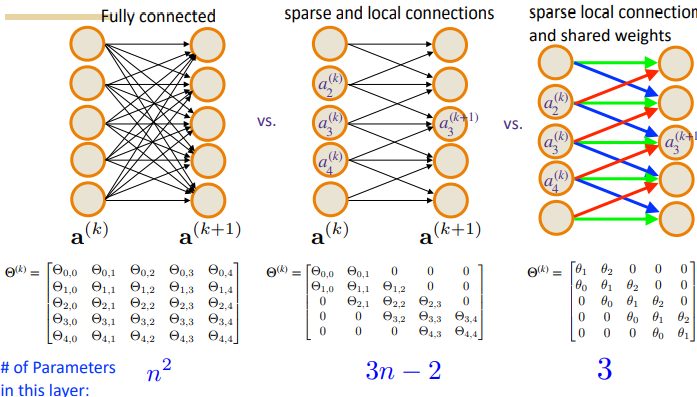

The filter is convoluted over the image. Convolution is nothing but an element-wise dot product between the kernel and image. It's the same as the linear layer but we share weights/use the same kernel over the entire image.

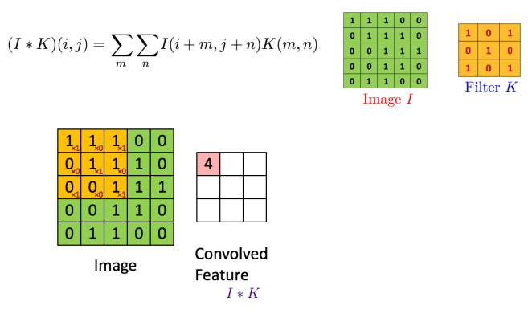

Say a convolution layer has 10 nodes. This means there are 10 filters of the same size but different values/weights applied to the image. After this, an activation function is applied for each node similar to the FCNs we saw before. ReLU is the most used activation function. Sometimes, there will be a pooling layer in order to reduce the dimensions. Below is an image of max pooling where the output contains only the max value in the region of interest. 

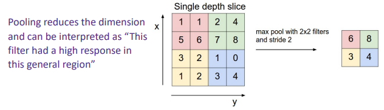

There could be additional layers. How many layers and how many filters/nodes/neurons per each layer is given by the network architecture. At the end, the image is flattened (make into a 1d array by spreading out each pixel value) in order to input into a softmax function to get the probability values. 

The filters have a few important hyperparameters (settings that need to be manually set by us and can't be learned by the model). Padding is often added to the image for making calculations feasible and preserving the input size. This is mostly done by adding zeros to all sides of the image. Next is kernel size which sets the amount of information retained from the image. A smaller kernel means more information. Mostly 3x3 or 5x5 kernels are used. Last one is the stride. It tells us how to move our kernel both horizontally and vertically across the image.

This is for a single-channel image. If it is an RGB image, then we have 3 channels so we follow a similar approach for each channel and stack them (sum them) up on each other. 

Refer to this [link](https://poloclub.github.io/cnn-explainer/#article-convolution) to visually understand what's happening inside a CNN.

It's important to know how the input size of the image changes at each layer. Say we have an input image of size $W_1* H_1 * C$ with K number of filers of size F and stride S with zero padding P, then the output is $W_2 * H2 * K$ where 

$$ W_2 = \frac{W_1-F+2P}{S} + 1 $$

$$ H_2 = \frac{H_1-F+2P}{S} + 1 $$

and the number of parameters is $F^2CK$ and K biases.
## CNN Architectures
### Inception
Also know as GoogleNet, is a 22-layer model architecture that was one of the successful models that came after AlaexNet and VGG. It all started with the choice of kernel size. AlexNet had a kernel size of 11x11 (hint: its too big) and VGG used 7x7. When the image information is more concentrated globally (like the full image is a dog), a large kernel size is preferred whereas when the information is concentrated more locally (a part of the image has a dog), a small kernel size is preferred. The authors of inception thought why not use multiple sizes on the same level? The network would be wider instead of deeper. This is the basis of naive inception.

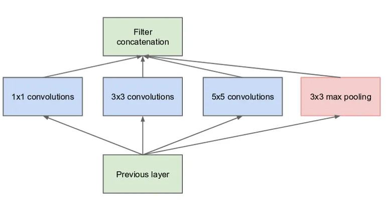

Each inception module performs convolution on an input, with 3 different sizes of filters (1x1, 3x3, 5x5). Additionally, max pooling is also performed. The outputs are concatenated and sent to the next inception module. This has low parameters which is good but this is computationally expensive to run. Because for each input we need to do multiple calculations due to multiple filters. The solution to this is *bottleneck*. It's all about using 1x1 convolutions. Say on an input of 56x56x64 if we use 32 1x1 filters the output is reduced to 56x56x32. These 1x1 convolutions are way more efficient. So the module is updated with adding 1x1 bottlenecks reducing dimensionality. These modules are used for 22 layers.

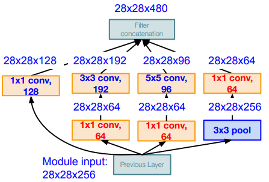

This same concept is updated with some smart ways like instead of using 5x5 filters, it is replaced with two 3x3 filters which is computationally expensive. Also factorizing filters i.einstead of using nxn filters, we use 1xn and nx1. These were proposed in inceptionv2 and v3. 
### ResNet
The paper that proposed ResNet was the most cited paper in all of the sciences. The issue with deeper models is the gradients die during backpropagation. ResNet solves this issue using residual connections. The idea is simple. Since the gradients are dying due to nonlinearity after convolution layers, we can have skip connections called residual connections without nonlinearity. In the image below we pass the input skipping a few layers so that during backpropagation, gradients flow back through those skip connections. The question might be how is input sizes configured in skip connections. Well, they have linear projections without nonlinearity to match the sizes.

In full-resnet architecture, we stack these residual blocks with two 3x3 conv layers in between. Periodically as the layer goes deeper, the filters are doubled and spatially downsampled using stride 2 which halves each dimension. There are variants of ResNet based on the number of layers like resnet18, 34, 50, 101, and 152. For models bigger than 50 layers, we use a 1x1 conv filter added at the start of the residual block.
### Xception

Xception aka Extreme Inception (created by the creator of Keras) builds upon the Inception architecture and extends it by replacing the standard convolutional layers with depthwise separable convolutions. The key idea behind Xception is to improve the efficiency and performance of the model by reducing the computational complexity and increasing the model's capacity for learning expressive representations.

Depthwise separable convolutions are a type of convolutional operation that decomposes the standard convolution into two separate steps: depthwise convolution and pointwise convolution. This technique aims to reduce the computational complexity of convolutional layers while maintaining their expressive power.

In a standard convolution, a kernel (also known as a filter) slides across the input data, computing a dot product between the kernel weights and the corresponding input patch at each position. The output of this operation is a feature map that represents the learned features.

In depthwise separable convolutions, the convolutional operation is split into two distinct steps: In the depthwise convolution step, each input channel is convolved with a separate kernel, also known as a depthwise filter. Each depthwise filter operates on a single input channel independently, scanning through the entire input volume. The depthwise convolution performs spatial filtering, capturing local patterns and information within each channel. In the pointwise convolution step, 1x1 convolutions, or pointwise filters, are applied to the output of the depthwise convolution.

Here are the main components and concepts of the Xception architecture:

* Depthwise Separable Convolutions: Xception extensively uses depthwise separable convolutions instead of standard convolutions. As explained earlier, depthwise separable convolutions decompose the convolutional operation into depthwise and pointwise convolutions, reducing the number of parameters and computations while maintaining representational power.

* Linear Bottleneck: Xception introduces a linear bottleneck module that consists of a series of depthwise separable convolutions. The linear bottleneck module helps to capture complex patterns and increase the model's capacity for learning high-level representations.

* Skip Connections: Xception utilizes skip connections, also known as residual connections, to improve information flow and gradient propagation. By connecting earlier layers directly to later layers, Xception enables the network to learn both fine-grained and high-level features and also as discussed earlier for backpropagation.

* Fully Convolutional Structure: Xception adopts a fully convolutional structure, which means it does not have fully connected layers at the end. Instead, it uses global average pooling to reduce the spatial dimensions, followed by a softmax activation for classification.
> Xception is the same inception but standard convolutions replaced with depthwise convolutions.
### DenseNet
The main idea behind DenseNet is to establish direct connections between layers within a dense block. A dense block is a group of consecutive layers, and each layer receives input from all preceding layers within the block. This connectivity pattern is in contrast to traditional CNN architectures, such as VGG or ResNet, where layers are connected sequentially.

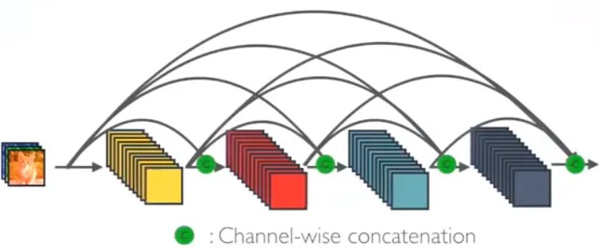

The dense connections enable each layer to have direct access to the feature maps of all preceding layers, promoting information flow throughout the network. This design choice has several advantages:

* Feature reuse: Since each layer receives feature maps from all preceding layers, it can reuse features computed at different depths of the network. This encourages the network to be more efficient in terms of parameter usage and enhances gradient flow during training.

* Gradient propagation: Dense connections alleviate the vanishing gradient problem by providing multiple paths for gradients to flow through the network. The gradients can reach earlier layers directly, bypassing fewer layers and avoiding the diminishing gradient issue.

* Enhanced representation: DenseNet facilitates the combination of features from different layers, which can lead to richer and more expressive representations. The dense connections enable the network to capture both low-level and high-level features, contributing to better overall performance.

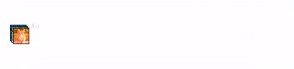

The DenseNet architecture is composed of several dense blocks, followed by transition layers. A dense block typically consists of multiple convolutional layers, which are interconnected via dense connections. Transition layers are used to reduce the spatial dimensions of the feature maps, typically by employing a combination of pooling and convolution operations. These transitions help in controlling the number of parameters and the spatial resolution of feature maps as the network progresses.

### MobileNet
It is specifically designed for mobile and embedded devices with limited computational resources. This is the same as xception but implemented instead of inception modules, layers are sequential and have no residual connections. Also pointwise convolutions are implemented after depthwise convolutions. MobileNet also introduces the concept of width multiplier and resolution multiplier to further optimize the model. Width Multiplier α is introduced to control the number of channels or channel depth, which makes C become αC where $\alpha$ is between 0 to 1. The width multiplier reduces the number of channels in each layer, effectively reducing the model's size and computational requirements. The resolution multiplier ($\rho$ in the range [0,1]) scales down the input resolution of the images by $\rho * input resolution$, providing a trade-off between accuracy and efficiency.

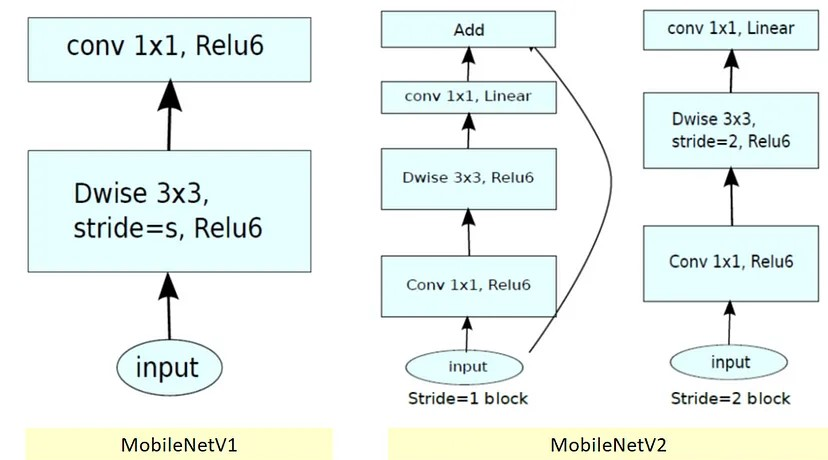

MobileNetV2 builds upon the previous version by adding these:
* Inverted Residuals: MobileNetV2 introduces a concept called "inverted residuals" or "bottleneck blocks." These blocks consist of a lightweight 1x1 pointwise convolution to reduce the number of input channels, followed by a depthwise separable convolution, and finally, another 1x1 pointwise convolution to expand the number of output channels. This design allows MobileNetV2 to capture complex patterns using fewer parameters and computations. Called inverted because in normal residuals the skip connection is between two conv layers but here it's between two bottleneck layers.

* Linear Bottlenecks: In MobileNetV2, the bottleneck blocks are modified to use linear activations instead of nonlinear activations like ReLU. This helps in reducing information loss and improves the flow of gradients through the network during training.

* Shortcut Connections: MobileNetV2 utilizes shortcut connections or skip connections between bottleneck blocks to facilitate information flow. These connections allow the network to bypass certain layers and provide a gradient path that helps in training deeper models.
## Training
### Activation Functions
As discussed above activation functions add nonlinearity to the model. Here are the popular choices. 

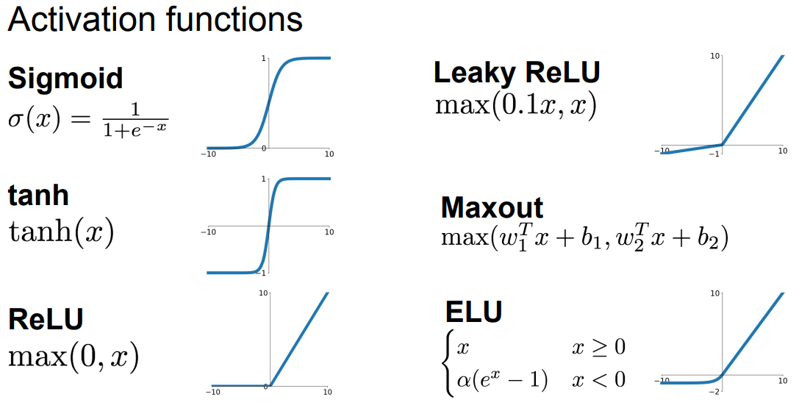

#### Sigmoid
This can be seen as a function that squashes every input to range [0,1]. Quite popular before 2012. There are several issues with sigmoid. 

1. When the gradients are small at the output layer and as the backpropagation moves backward, it has to go through the sigmoid gate. As we see in the graph, small input to the sigmoid returns zero. If the gradients flowing back is zero, all gradients from that layer to the input layer remain zero and weights will never change thus no learning happens. This result of no convergence due to small gradients is called **vanishing gradients**. Similarly, when the gradients are too large, the sigmoid output will be zero (see the graph) causing a similar problem. This is called **exploding gradients**.
2. Another issue with sigmoid is that, it is not zero-centered. It always gives a positive output. Thus gradients are always all positive or all negative thus not optimizing well.
3. Another minor issue is we need to calculate exponential which can be computationally expensive.
### Tanh
This squashes numbers to range [-1,1] and now its zero centered. But the issue of vanishing and exploding gradients remains the same. Just observe the output graph, when there is a constant region, then the gradients are getting saturated.
### ReLU
The gradients don't saturate in the positive region and are computationally efficient and converge faster than sigmoid and tanh in practice. Thus this is the most common choice of activation functions. But the issue is in the negative region and the issue of vanishing gradients remains the same. Also, it is not zero-centered as the outputs are never negative.
### LeakyReLU
It's the same as ReLU except for the negative region. Here the gradients will never die in both positive and negative regions.
### ELU
Exponential linear unit introduces an exponential function in the negative region. This has all features of ReLU along with zero centered and is more robust to noise in the negative regions than LeakyReLU. 
### GeLU
Gaussian Error Linear Unit is a quite popular choice for transformers. When the input is positive, it is similar to ReLU. In the negative region, we will have a threshold. If the value is below the threshold then they are allowed and other input values are squashed to zero. This means all negative inputs are not allowed thus adding randomness. We try out various thresholds and take **expectation over randomness**.

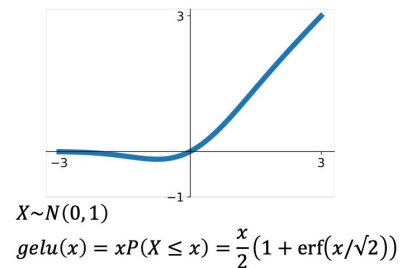
### Data Preprocessing
It is often preferred to make the data zero-centered and normalize the data. With normalization, the model is less sensitive to small changes in weights.

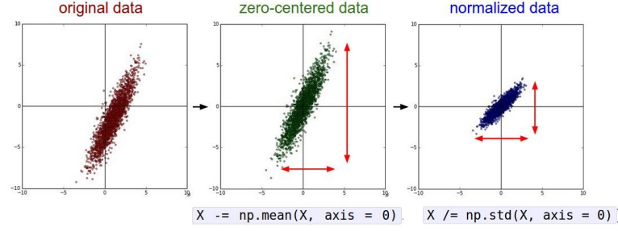

For images, in practice, the mean is calculated for each channel of the images, and the mean is subtracted from the respective channel pixels values making each channel zero-centered.
### Weight initialization
While discussing backprop, we said we initial starting weights randomly. What if we used `W=constant init` i.e use same weights for all nodes? If weights are all the same at the start then gradients will also be the same for all nodes. Then no matter how many layers we add it is still same as a single layer.

What if we use random values? We can use `W = 0.01 * np.random.randn(Din, Dout)` the output weight matrix will be Din x Dout dimensions. This works for smaller networks but not for deeper networks(more layers). Since the weights are small, taking gradients will result in a vanishing gradients problem. Then we might use larger weights like `W = 0.05 * np.random.randn(Din, Dout)`. But these weights are too big and result in exploding gradients. Uff, so weight initialization is tricky and important. In practice, we use something called **Xavier** initialization, `W = np.random.randn(Din, Dout)/ np.sqrt(Din)` this solves the gradients issues. Another popular coice is **He** initialization (ResNet), `W = np.random.randn(Din, Dout)/ np.sqrt(2/Din)`
### Batch Normalization
As we have deeper networks, the distribution of each layer changes due to the weight updates. This is called internal covariate shift. When previous layer distributions change, the next layer needs to constantly adapt to these changes thus more time to converge. Batch normalization explicitly makes our data zero means and unit variance in between layers. 

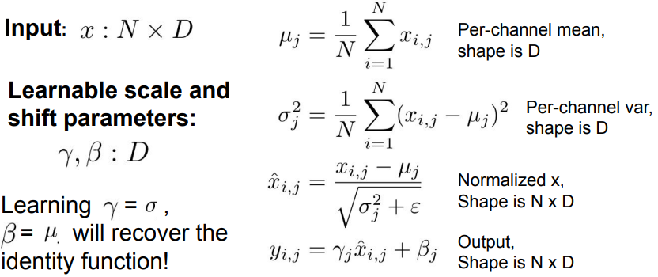

$\gamma$ and $\beta$ are learnable parameters to use different standard deviations and biases respectively. Batchnorm is used just like an extra layer usually inserted after convolutional layers and before activation functions. During training, BatchNorm keeps track of two sets of statistics for each batch-normalized layer: the running mean (μ) and the running variance (σ^2). These statistics are computed by accumulating the mean and variance of the activations across mini-batches during training.

During testing, instead of using the statistics from the mini-batch, BatchNorm uses the accumulated running mean and running variance. This can be an issue as the testing doesn't happen as it should instead uses training data statistics.

The testing procedure can be summarized as follows:
1. For each mini-batch or individual example during testing, the input activations of the batch-normalized layer are normalized using the running mean (μ) and running variance (σ^2).
2. The normalized activations are then scaled and shifted using the learned scale (γ) and shift (β) parameters, respectively, which are also accumulated during training.
3. The scaled and shifted activations are passed through the rest of the network for prediction or inference.

Batch normalization makes deep networks much easier to train, improves gradient flow, allows higher learning rates, robust to weight initialization, and also acts as a regularizer. Only issue is different behaviour during train and test.

Layer normalization is another variant where normalization is done across the dimensions instead of batches thus having the same behavior during train and test.

### Learning Rate Schedule
Learning rate is a hyperparameter and choosing a learning rate is quite tricky. Because using a low learning rate increases training time and also isn't helpful to get out of local minima. If we choose a high learning rate, convergence is unstable. The best choice is to use a high learning rate at the start (its fast) and use a small learning rate while reaching the global minima (doesn't overshoot). This is done by learning rate schedular for learning rate decay.

One option we have is to manually input the learning rate at fixed points. For example, multiplying the learning rate by 0.1 after epochs 30, 60, 90 for ResNets. We can generally decide at which epoch by looking at epoch vs loss graph. The epoch were the curve plateaus is where we need to decrease our learning rate. But finding these values for another task is a cumbersome process. One popular schedular is **Cosine** where we fix the number of epochs($T$) and initial learning rate($\alpha_0$) at first. Learning rate an epoch t is given by

  $$ \alpha_t = \frac{1}{2} \alpha_0(1+cos(\frac{t\pi}{T})) $$

This is how the decay looks:

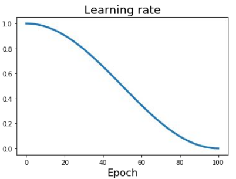

Another popular choice is linear, $\alpha_t = \alpha_0(1-\frac{t}{T})$. 

There is one issue with choosing a high learning rate at first. With high LRs, we might go too far away from global minima and it disturbs all the initializations we carefully crafted. So we use something called **linear warmup** which starts with a very small learning rate for a few iterations or epochs and then moves to a higher learning rate.

> Epochs means the number of times we loop over our entire training data to learn. We do multiple iterations within a single epoch. For example, we have 1000 training samples and a batch size of 100. So in each iteration, our model tries to learn 100 samples. 10 iterations will equal one epoch.
### Dropout
It is a regularization technique where we randomly set some neurons to zero (removing). We have a hyperparameter, the probability of dropping. If it is set to 0.5, then only half of our neurons will be active in a layer.  During test time, since we can't randomly drop neurons, we multiply the output of hidden layers with some probability percentage p to decrease the activations.
## Transfer Learning
Many think that we need a lot of data to train CNNs but actually, we don't. We know that initial layers of CNN learn low-level features like edges, and corners which don't change much depending on the dataset. As layers progress, high-level features specific to the data are captured. So the idea is to train these low-level layers on one specific dataset and use those trained weights and biases on a different dataset. This is called Transfer learning. It is a technique where knowledge gained from training a model on one task is leveraged to improve the performance of a model on a different, but related, task. Instead of training a model from scratch on a new task, transfer learning allows the model to transfer its learned knowledge and representations from the source task to the target task.

During transfer learning, the lower layers of a pre-trained CNN, which have learned low-level and intermediate features, are typically kept fixed or frozen. This is done to preserve the general representations learned from the source task. The last layers of the CNN are then replaced or modified to suit the target task, allowing the network to learn task-specific features and make predictions accordingly. By fine-tuning the last layers, the model can adapt its knowledge to the specific nuances and requirements of the target task, while still benefiting from the pre-trained feature extraction capabilities of the earlier layers.

In general, modern architectures like ResNet, and Inception are trained on ImageNet where the last layer is a fully connected layer with output dimensions being 1000 for 1000 classes. In transfer learning, we freeze the weights of all layers except the last layer. The last layer is changed to a fully connected layer with output dimensions of C for C classes in a new dataset. Only this layer is trained. If you have a bigger dataset, train all of the last fully connected layers. But remember tasks should be similar to image classification. The more data we have and the more different the task is, we need to finetune (training) more layers starting from the last.
# Self-Supervised Learning
Supervised learning is quite expensive due to the manual annotations/labels. Apart from cost, it is more prone to errors in annotations. Even the standard ImageNet has wrong labels. Options outside of supervised learning are semi-supervised, unsupervised, and self-supervised. Semi-supervised learning is to train on unlabeled data along with some labeled data. This is quite popular over a period but is still an active area of research. Getting good results from unsupervised learning is hard as there is no feedback or guidance. That left us with self-supervised learning (SSL). 

> Self-supervised learning aims to learn useful representations or features from unlabeled data without explicit human annotations.

The confusing part is how is it different from unsupervised. In SSL, we do some prediction, $\hat{y}$ which is within the input data itself unlike learning some distribution. There are two steps in SSL.

1. Pretrain a network on a pretext task (will be explained) that doesn't require supervision.
2. Transfer the learned network to a downstream task via linear classifiers, KNN, and finetuning.

Pretext tasks are in general 3 types. Generative pretext tasks predict part of the input signal like Autoencoders, GANs. Discriminative predicts something about the input signal like contrastive learning, rotation+clustering, and multimodal use of additional signals in addition to RGB images like Video, 3D, Audio, etc.

A common example of a pretext task is we give cropped images to the model and make the model predict the complete image or rotate the image and make the model predict the non-rotated image etc. A downstream task could be anything like object detection, image classification etc. Pretext tasks need not be related to downstream tasks. Evaluation of an SSL model is only based on the downstream task. We don't care about pretext task performance.

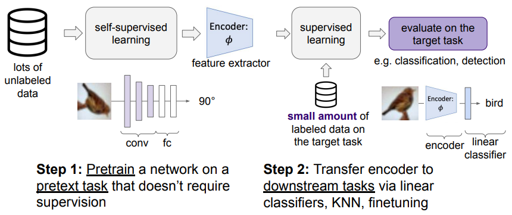

A detailed example of a pretext task is to predict rotations. From our data, we rotate the image is 4 ways and the prediction is which way the image is rotated. This became a supervised classification problem but no annotation is required. This way we are forcing the model to learn about image representations and use these learned features for some downstream tasks like image classification(1 way).

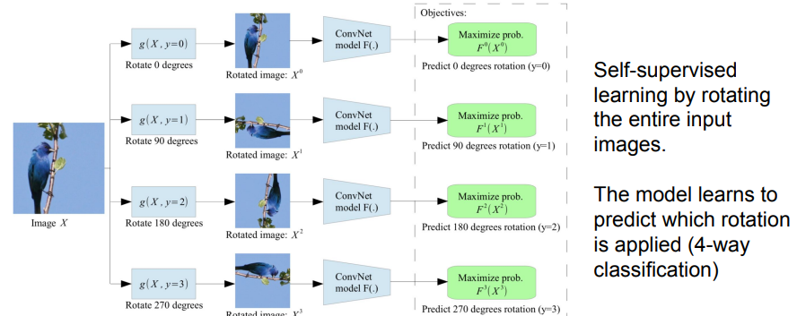

Our pretext tasks shouldn't be too easy as the model might learn shortcuts/irrelevant features and it also shouldn't be too hard as the model might be too fixated on pretext tasks and wouldn't work on downstream. Other good pretext tasks are inpainting, jigsaw puzzles, colorization, etc. We don't usually know which pretext works well unless we use it for our downstream task. 

### Contrastive Learning
A generalized method for a pretext task would be to use different transformations at the same time. For example, we have a cat and dog image. We then apply different transformations on the cat image and on the dog image. In a latent space (lower dimensional space), the transformed image features of a cat should be closer to each other (attract) and far from the transformed image features of a dog (repel). This method is called contrastive learning.

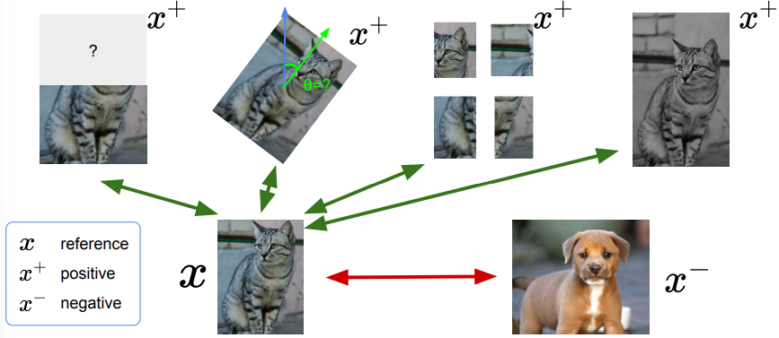

Our goal is to $score(f(x),f(x^+)) >> score(f(x), f(x^-))$ i.e our score (similarity score) between reference sample and positive sample should be higher than a score between reference sample and negative sample.

A loss function for contrastive learning given 1 positive sample and N-1 negative samples:

$$ L = -E_X[log \frac{exp(s(f(x),f(x^+)))}{exp(s(f(x),f(x^+))) + \Sigma_{j=1}^{N-1}exp(s(f(x),f(x_{j}^{-})))}] $$

This is called InfoNCE loss (Information Noise Contrastive Estimation) and kind of looks like softmax loss where we have our reference images as the true class and its transformations (positives) as also the true class and every other negative as another class. 
#### SimCLR
A simple framework for Contrastive Learning of visual Representations (SimCLR) was one of the first models to achieve comparable results with supervised learning. 
1. The model starts with a data augmentation model that transforms a data sample image, $x$ into two correlated views by transformations $\hat{x_i}, \hat{x_j}$ like random crop, crop and resize, color distortion etc. Thus our dataset will now be 2N as each image is augmented with two transformations.
2. The transformed images $\hat{x_i}, \hat{x_j}$ are passed through a base encoder, $f$ to extract the image representations, $h_i, h_j$. The paper uses a ResNet50 (the last FCN is removed) to extract the representations.
3. Instead of applying the loss functions on representations directly, representations are passed through a small hidden layer neural network projection head with nonlinearity, $g$ (not entirely clear why but the paper says due to nonlinearity, representations learned will be better with projection head). The goal is to maximize the score for representations that we after projection head, $z_i, z_j$.
4. In practice, we randomly sample a minibatch of N examples and define
the contrastive prediction task on pairs of augmented examples derived from the minibatch, resulting in 2N data points. We do not sample negative examples explicitly. All other images, 2(N-1) other than two correlated transformed images are given as negative. Similarity score is given by cosine similarity, $sim(u,v) = \frac{u^Tv}{||u|| ||v||}$. This ranges from 1 to -1 where 1 means both vectors, u and v, point to same direction and high similarity. -1 means vectors are pointing opposite and 0 means vectors are uncorrelated.
5. The loss function is same InfoNCE loss which is here modified slightly as

$$ L = -log \frac{exp(sim(z_i,z_j))}{\Sigma_{k=1}^N 1_{[k\neq i]} exp(s(z_i,z_j))} $$

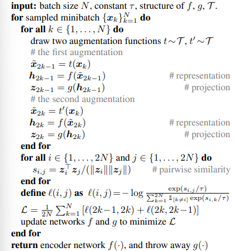

After training the ResNet model using representations, we use this ResNet in some downstream tasks like image classification by adding a linear classification layer at the end. The paper achieved similar results as supervised models on the ImageNet dataset. But with a batch size of over 8000 and with 4 times wider ResNet architecture. 

SimCLR needs a huge batch size in order to train effectively. The paper uses LARS optimizer to optimize for higher batch sizes. **Decoupled Contrastive Learning** (DCL) is a modification of the contrastive learning framework, specifically designed to address some of these batch size limitations and challenges associated with the negative-positive coupling (NPC) effect in the InfoNCE loss.

The issue of the NPC effect in the loss arises from the way negative samples are chosen during training. When we take a batch of images, we select the positive pairs and all the remaining samples are treated as negative. When we have a large batch size, there wouldn't be any issue as there are enough negative samples for the model to learn underlying representations. But with a lower batch size, the negative samples chosen for a positive pair are too easy to distinguish from the positive sample, leading to an overly optimistic loss landscape and poor learning of representations.

This is where Decoupled Contrastive Loss helps. As the name says,  the positive sample is removed from the denominator, resulting in a loss calculation that considers only the negative samples. By excluding the positive sample the loss becomes more focused on the relative similarities among the negative samples. This decoupling reduces the influence of the positive sample, making the loss more informative and less prone to the NPC effect, and also can be used with lower batch sizes.
#### Momentum Contrastive Learning (MoCo)
In MoCo, instead of having every other sample as a negative sample, we keep a running queue of negative examples (called keys) for all of the images in our batch. The batch size is decoupled with the number of keys. For example, we have a running queue of 2000 keys/negative samples. Say our batch size is 1000, we use all the 2000 keys to compute gradients and update the encoder. 

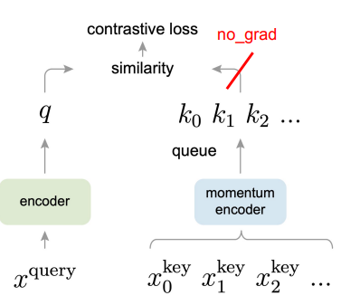

We have a similar encoder setup as SimCLR for the query/reference image and get the feature representations (all these will be positives) on the other side we have running keys and then the loss is compared and gradients flow back only through the query encoder (left side). How the negative samples are chosen is simple. For the current batch, all the images from the previous batch are chosen as negative samples (some extra images can also be added or the previous two or three batch sizes can be combined), hence called *running* keys. If there are no gradients passed through the momentum encoder then how are its parameters updated? The momentum encoder is updated similarly to SGD. The key network's parameters are updated using a moving average of the query network's parameters. This update is performed iteratively, where at each step, a fraction of the query network's parameters are mixed with the key network's parameters. This process helps create a more stable and consistent representation space.

MoCo V2 is also released by combining MoCo and SimCLR by using a projection head on the query encoder. 
#### DINO
This is a combination of SimCLR and MoCO but more of a distillation problem. 

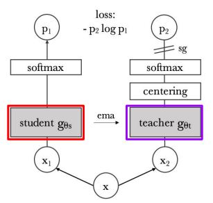

1. The reference image is transformed into two images. One image is transformed using local augmentations like crop and resize and other image is global augmentation like grayscale, and color distortion (no crop). The local augmented image is given a student encoder model and the global one is given to a teacher encoder model.
2. Both encoder models are vision transformers and as you can see there are no negative samples involved here.
3. Centering is similar to normalizing where dimensions are centered to remove any dominant dimension.
4. The teacher network's parameters are updated using a momentum update mechanism. This involves copying a fraction of the student network's parameters and updating the teacher network's parameters towards the student's parameters. This update process is performed iteratively, and it helps stabilize the training and ensures that the teacher network slowly tracks the student network.
5. The student network is trained to predict the intermediate representations produced by the teacher network. This is achieved by minimizing a contrastive loss, which encourages similar instances to have high similarity scores and dissimilar instances to have low similarity scores.

# Vision and Language
## Recurrent Neural Networks
We are now moving towards language from vision. The main difference between language from vision is the sequences (video is an exception) like given a word/letter what is the next word/letter? RNNs are the starting models for processing sequences. The key idea of RNN is they have an internal hidden state (green box) that is updated as a sequence is processed and it is updated recurrently after every output. 

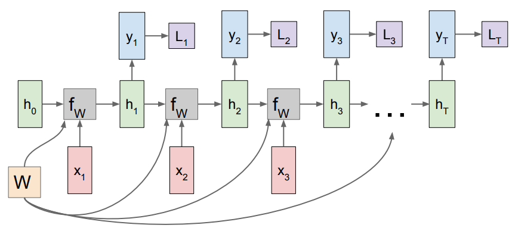

The hidden state keeps track of all the previously seen inputs. It is updated after every new input by applying a recurrence formula as follows:

$$ h_t = f_W(h_{t-1}, x_t) $$

The present state is given by some function with weights W (a neural network) which takes in input at the present time step and the hidden old state. While reading a sequence, if RNN model uses different parameters for each step during training, it won't generalize to unseen sequences of different lengths. Observe here that the weights are shared so it doesn't matter how long the input is. The initial hidden state is usually zeros. In the case of a vanilla RNN, $f_W$ looks like:

$$ h_t = tanh(W_{hh}h_{t-1} + W_{xh}x_t) $$

and output is given by $y_t = W_{hy}h_t$. The final loss is given by summing all the individual losses. 

The above case is if we have multiple outputs like the next words. Incase of sentiment analysis we might have just one y based on multiple inputs something like whether the statement is positive or negative. Then the loss is only given by the final y. 

Sometimes there might be multiple outputs but a single input like image captioning (describing what's happening in the image). Then the process remains the same keeping inputs of the next hidden units are zeros or can be the output of the previous input. 

Lets see an example now, say we are training our model to predict the next character, the model looks like:

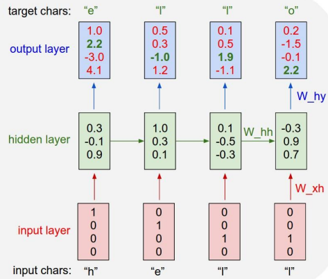

As you can see the inputs are given in the form of one hot-encoded vector. Our weight matrix for the looks like this:

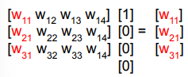

During the test time based on the output score, the next character is given as the input to the next state and so on the word is predicted.

Similar to a normal neural network, we do backpropagation. But it has to load the memory with the weights of every character. This will blow up our memory for long articles. So instead of backpropagating the entire article we take chunks of data at a time and backpropagate and then go for the next chunk in the document.

Image captioning is as simple as combining CNN with RNN and using start and end tokens to say when to stop generating captions.

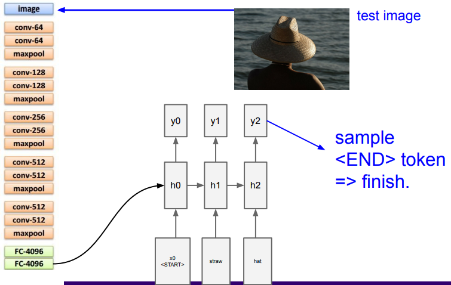

Even with all these RNNs are not popular. Because when we think of backpropagation, we know that tanh squashes everything to [-1,1]. When the gradients are flowing back, many values less than 1 keep getting multiplied. By the time gradients from the last hidden state come to the first hidden state the gradients become very very small causing a vanishing gradients problem. This problem is solved by LSTMs.
## Long Short Term Memory 
It is a variant of RNN and also follows similar weight sharing. There are many new terms involved here. In RNN we only combine the previous hidden state with the present input using a neural network and passing through a tanh. But in LSTM we have four such activation functions with their own task.
* i: input gate: decides whether to write to cell
* f: Forget gate: decides whether to erase cell
* o: Output gate: decides how much to reveal cell
* g: info gate: decides how much to write to cell

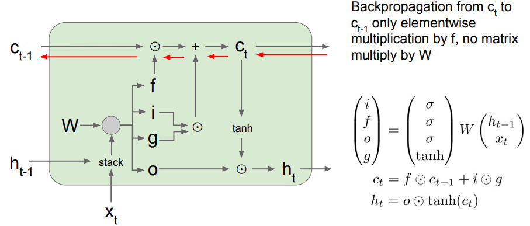

The first thing is to observe the cell state line which is at the top with C labels. It kind of looks like a single highway. The LSTM does have the ability to remove or add information to the cell state, carefully regulated by structures called gates. Let's understand it with an example (copied from colah's blog). 

The first step in our LSTM is to decide what information we’re going to throw away from the cell state. This decision is made by a sigmoid layer called the “forget gate layer (f).” It looks at $h_{t−1}$ and $x_t$, and outputs a number between 0 and 1 for each number in the cell state $C_{t−1}$. We multiply $f_t$ with the previous cell state, $C_{t-1}$ to get only the things we want after removing things we need to forget. Let’s go back to our example of a language model trying to predict the next word based on all the previous ones. In such a problem, the cell state might include the gender of the present subject, so that the correct pronouns can be used. When we see a new subject, we want to forget the gender of the old subject. 

The next step is to decide what new information we’re going to store in the cell state. This has two parts. First, a sigmoid layer called the “input gate layer(i)” decides whether to update. Next, a tanh layer (g) creates a vector of new candidate values that could be added to the state. In the next step, we’ll combine these two to create an update to the state. This multiplied g and i is added to the previously multiplied f gate. In the case of the language model, this is where we’d actually drop the information about the old subject’s gender and add the new information, as we decided in the previous steps.

Finally, we need to decide what we’re going to output. This output will be based on our cell state, but will be a filtered version. First, we run a sigmoid layer (o) which decides what parts of the cell state we’re going to output. Then, we put the cell state through tanh and multiply it by the output of the sigmoid gate, so that we only output the parts we decided to. For the language model example, since it just saw a subject, it might want to output information relevant to a verb, in case that’s what is coming next. For example, it might output whether the subject is singular or plural, so that we know what form a verb should be conjugated into if that’s what follows next.

How does this LSTM fix the vanishing gradients? Remember the highway of the cell state? When the gradients need to flow back, they flow back through this highway without going through activations functions thus preserving our gradients. This doesn't entirely solve the problems but it works for most of the cases.

There are many other versions of LSTMS. Gated Recurrent Unit, or GRU, is one such popular version. It combines the forget and input gates into a single “update gate.” It also merges the cell state and hidden state and makes some other changes. The resulting model is simpler than standard LSTM models and has been growing increasingly popular.

## Attention
Take an example of image captioning. The entire image is passed through a CNN model to get the hidden representation and this hidden representation vector is passed through the RNN or LSTM. But what if we need to generate a 100-word caption about the image? Our hidden representation should encode the information needed for a 100 words caption which is not easy.

When we think about how we process the image, we won't process the entire image in one go right? We pick up things one by one and observe different parts of the image at a time. This idea leads to attention blocks. Instead of appending everything to a single vector, we do it in blocks. 

Before going into attention, lets talk about spatial features. After an image is passed through a CNN, we get a hidden representation,$h$ by using a fully connected layer at the end. The input to the fully connected layer is the spatial features matrix, $z$. Using h and z as inputs to a multi-layer perceptron (or could be just h.z or anything more complex), we get scalar values called alignment scores. Applying a softmax function on these scores will give us normalized attention weights. These scores will tell us how important a particular region is. Based on the score, the model determines the amount of attention a region needs. These weights are multiplied with the spatial features and then summed to give the context vector, c. This context vector is passed through the RNN or LSTM.

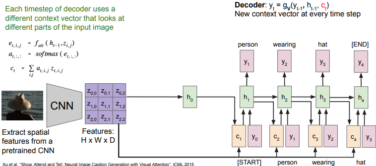

If we take an example of NLP language translation, this is how attention works

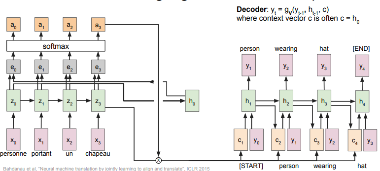
### General Attention Layer

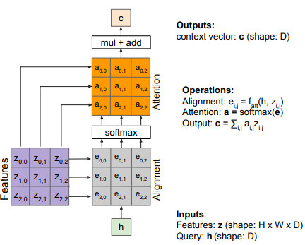

We will generalize the attention model we learned for image captioning to other general applications. We will start by stretching the spatial vectors into a single vector of N = H*W. Instead of using a complex MLP, we will use a dot product but to reduce the effect of large magnitude vectors we will normalize by dividing with sqrt of input dimensions. 

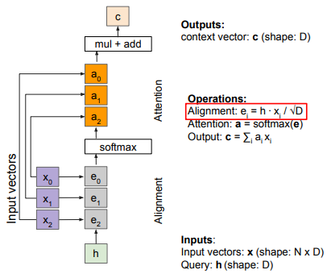

Will go a little bit further. Instead of using a single input query (Our h is called query here), we can use multiple queries and produce multiple context vectors at the same time. 

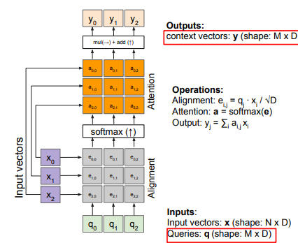

Here we are using our spatial/input vectors used for both alignment and attention calculations. We can fine-tune this by using linear layers (fully connected) on input vectors to get keys and vectors which will be used for alignment and attention respectively. The input and output dimensions can now change depending on the key and value layers. The below model is the generalized attention model used in most of the applications.

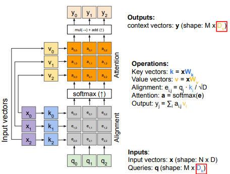

### Self Attention
Remeber that the queries are derived from spatial features by applying a fully connected layer to flatten. So we can change our attention to the following:

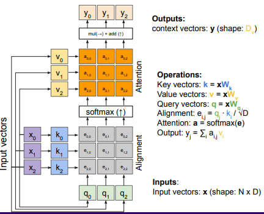

Thus we can say that we have some inputs coming in and passed through the self-attention block we get outputs. The order of inputs doesn't matter, it can take input in any order but the output order also changes accordingly. It isn't an issue for an image but for language order is important so the inputs are first passed through a position encoding, p to get representations for inputs. The purpose of positional encoding is to inject this positional information into the self-attention mechanism so that the model can distinguish between different positions in the sequence and learn dependencies based on their relative distances.  The most common approach to positional encoding is to use sinusoidal functions to encode the positions. The positional encoding matrix has the same dimensions as the input embeddings. Each row of the matrix corresponds to a position in the sequence, and each column represents a dimension of the input embeddings. The value at each position and dimension is determined by a combination of sinusoidal functions. The values are determined by using sin and cos with varying frequencies. It's not important for us but just think of it as a binary representation of input vectors so that the model learns the positions.

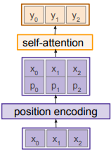

Masked self-attention is a variant of self-attention where certain positions in the input sequence are masked or ignored during the attention computation. The purpose of masking is to prevent the model from attending to future positions in the sequence when making predictions for a particular position. In the context of language modelings or autoregressive tasks, such as machine translation or text generation, the model generates tokens one by one, and it should only have access to the tokens that precede the current position. Masked self-attention ensures that the model attends to and utilizes only the previously generated tokens during the prediction process, preventing it from accessing future tokens.

Multi-head self-attention is an extension of the self-attention mechanism used in the Transformer architecture. Instead of relying on a single attention mechanism, multi-head self-attention introduces multiple parallel attention mechanisms, called attention heads, to capture different types of relationships and dependencies within the input sequence. In the context of natural language processing tasks, such as language translation or text generation, different attention heads can focus on different aspects of the input, such as word order, syntactic structure, or semantic relationships. Each attention head learns to attend to different parts of the input sequence independently, enabling the model to capture diverse patterns and interactions.

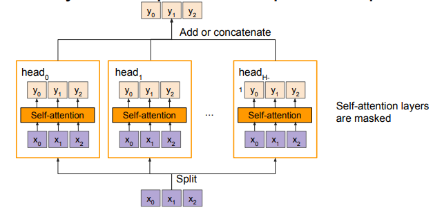

## Transformers
For the same image captioning example, the transformer model looks like:

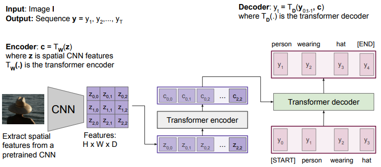

Inside the transformer encoder block, there can be N encoder blocks. It looks like: 

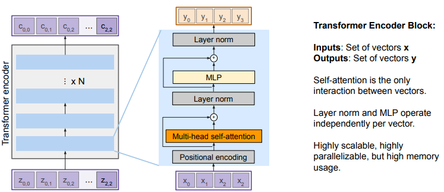

Inside the transformer encoder block, there can be N encoder blocks. It looks like: 

The C-shaped connections with a plus sign are residual connections. It is the same as the encoder block but the difference is masked self-attention at first and the use of a generalized attention model with keys, values, and queries.

Models now don't even need the CNN first. All of the computer vision now involves breaking down the images into patches and using a transformer. This model is called ViT(Vision Transformers). We split an image into patches, then flatten the patches and produce a lower dimensional embedding using a linear conv layer. Then add a positional encoding to encode the location of each patch within the image. Feed the sequence as an input to a standard transformer encoder. The common patch size is 32x32 or 16x16. More the patch size lesser the number of input sequences thus less compute needed but less accuracy. The difference between CNN is the CNN starts with local relations and then looks globally it has implicit bias. But transformers do everything from scratch and iterate with more attention on specific regions thus needing large data.

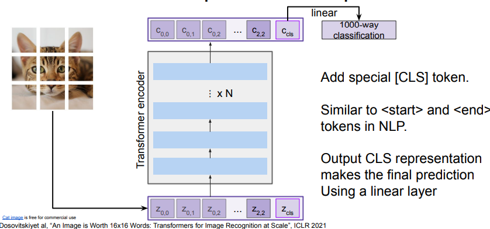

# Structured Prediction
In contrast to standard classification or regression tasks where the output is a single label or value, structured prediction tasks aim to model and predict the dependencies and relationships among multiple output variables. There are three major structured predictions in computer vision: semantic segmentation, object detection, and instance segmentation.
## Semantic Segmentation
It involves assigning a class label to each pixel in an image, thereby dividing the image into different regions or segments based on their semantic meaning. The goal of semantic segmentation is to understand the detailed semantics and boundaries of objects or regions within an image. In semantic segmentation, each pixel is classified into one of several predefined categories or classes, such as a person, car, tree, sky, road, etc. Think of it like image classification for each pixel.

But the issue is how to label each pixel because just one pixel won't have enough context to do classification. So to get more context we can take patches of image instead of a pixel. For every patch, we will only label the center pixel of that patch so that we are using context from neighboring pixels instead of just one pixel. But we need to have so many patches such that every pixel is centered for at least one patch which is inefficient. So we move to convolutions where filters are used on patches. But in general, CNNs reduce the spatial dimensions when going through layers for less computing and the final output will be a single-dimensional vector but semantic segmentation should have the same output size as input as it is per-pixel classification. So our CNNs should use full image propagating through layers without reducing spatial dimensions. But it needs a lot of computing. 

The final idea to implement semantic segmentation is to do downsampling where spatial dimensions are reduced and trained on these lower dimensions and then do upsampling to get back to the original dimensions. We know downsampling which happens in CNNs but what how to do upsampling to increase the image spatial dimensions? We can do max unpooling where before downsampling images, model learns at what poisition there is a max element in a patch and during upsampling, we use the value in lower dimension in place of learned positions in higher dimensions.

For better compute, we do transpose convolution where the filer is convoluted on the output instead of image. A filter is learned such that that filter is multiplied with the value from smaller dimensions to get the upsampled output. 

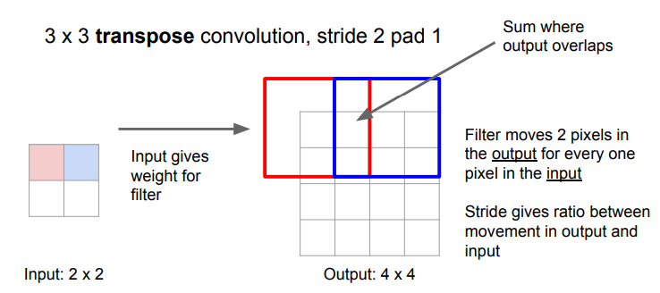

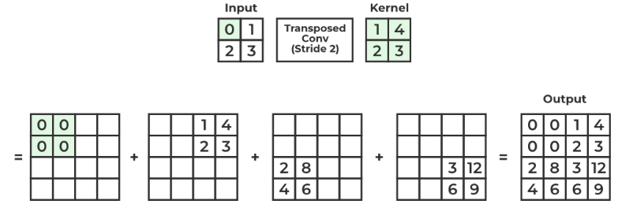

The overall semantic segmentation looks like this (called Unet):

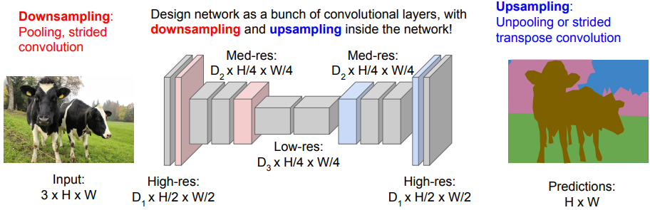

In semantic segmentation, each object in the image is segmented but it won't segment each instance. 

## Object Detection
It involves identifying and localizing multiple objects of interest within an image or a video. The goal of object detection is to not only determine the presence of objects but also to precisely locate them by drawing bounding boxes around each detected object. We can think of doing image classification as well as regression for bounding box coordinates. 

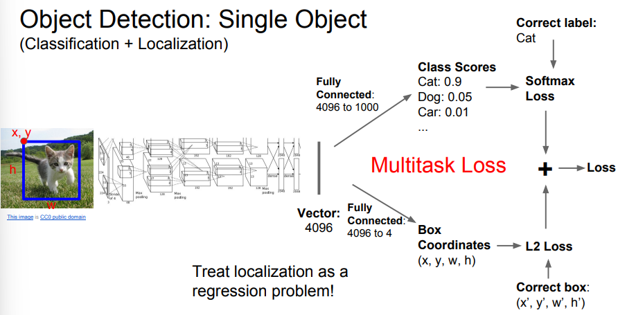

### Region Based
Our goal is to upgrade this to multiple object detection. We can use the same old sliding window where we take crops of images and do single object detection. But this is difficult because our window size can not be of the same size and we take infinite crops. One popular approach in region proposals is selective search. Instead of doing an infinite number of crops, we use some algorithms to get limited region proposals (image crops) that are likely to have an object. One such algorithm is the F&H algorithm which we use to get different regions of an image and do similarity criteria like color, size, and texture to detect the regions and sizes of crops (it is a bottom-up approach that starts with small crops and greedily merge to get final region proposals). 
### R-CNN
We take an image and do a selective search that gives around 2k region proposals and we use CNNs on each proposal to extract features and fed to SVM for classification and do regression for bounding boxes. Each region becomes a single object detection and localization we discussed before.

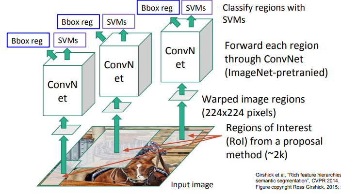

But the issue with this is doing all these operations on 2k regions per image is still expensive.
### Fast R-CNN
To make R-CNN fast, we can pass images through CNN first and extract features and get regions for these features. 

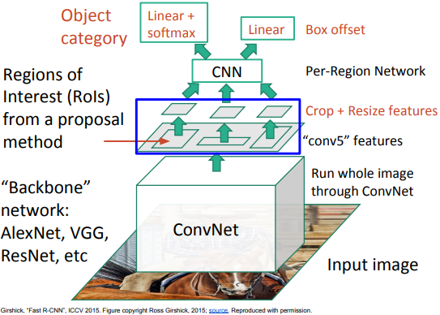

The question is how to get region proposals on features. One idea is RoI Pooling. We extract the 2k regions like rcnn and project those onto the extracted features we get after CNN i.e. each region proposal is mapped to the corresponding region of the feature maps. To achieve this mapping, the coordinates of the region proposal are aligned with the spatial dimensions of the feature maps.

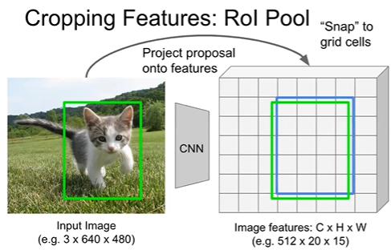

Of course the dimensions don't match as CNN lowers the spatial dimensions, so we find the nearest pixel location to align the regions on the feature map. We divide this aligned region into sub regions and do max pooling to get a summary of the information. The max-pooled values from each sub-region are concatenated to form a fixed-size feature representation for the corresponding region proposal. This fixed-size representation can be passed through fully connected layers for further processing.
### Mask R-CNN
The obvious issue with this is the region misalignments on the feature map. To counter this **mask rcnn** is proposed where we have the region proposal from selective search and we place on top of our feature map. The region is subdivided equally (usually into 4 regions) and in each region, we sample 4 sub-points. The point of the feature map is determined by the weighted linear combination of features at its four neighboring grid cells. Thus the regions on feature maps are much aligned we do max pooling like earlier.

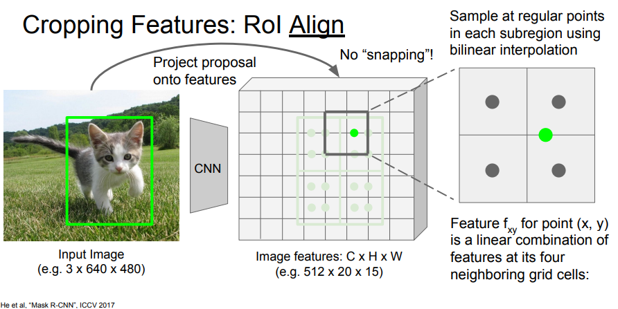

### Faster R-CNN
The majority of time is taken by selective search to get region proposals. So faster rcnn gets rid of selective search, it learns the region proposals using deep learning techniques.

Think of faster rcnn as the same as fast rcnn except for the way we get the initial region proposals. So what happens inside the Region Proposal Network (RPN)? 

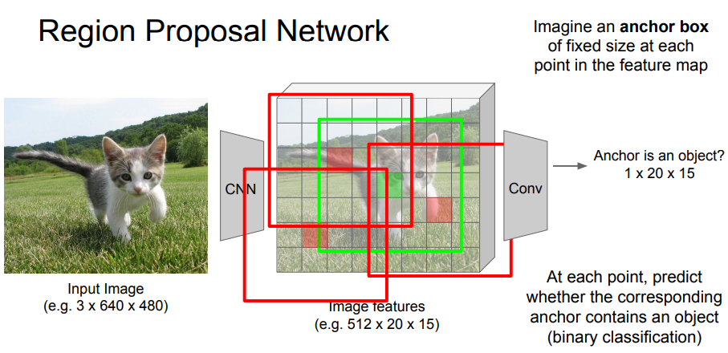

Here region proposals are called anchor boxes which are predefined bounding boxes of various scales and aspect ratios that are centered at a position. An anchor is a box. In the default configuration of Faster R-CNN, there are 9 anchors at each position of an image with different lengths and widths and in total around 2000 hand-crafted anchors per image.

For each anchor box, the RPN predicts two essential pieces of information:

Objectness Score: The RPN predicts whether an object is present or not within each anchor box. This is represented by a binary classification output. The objective is to differentiate between foreground (containing an object) and background (not containing an object). This helps the RPN to filter out most of the background regions and focus on potential object regions.

Bounding Box Regression: In addition to the objectness score, the RPN also predicts the refinement offsets for each anchor box. These offsets provide corrections to the anchor box's coordinates, enabling a more accurate localization of the object within the anchor box. The predicted offsets adjust the anchor box's position, width, and height to tightly fit the object's actual boundaries.

To generate these predictions, the RPN typically consists of a few convolutional layers followed by two sibling fully connected layers: the classification layer and the regression layer. These layers take the feature maps as input and generate the objectness scores and bounding box regression predictions for each anchor box.

During training, the RPN requires ground truth annotations (hand-crafted anchors) to compute the training targets. The ground truth annotations provide information about which anchor boxes should be labeled as foreground (positive) or background (negative) and the corresponding bounding box regression targets.

The RPN is trained using a multi-task loss function that combines two components:

Objectness Classification Loss: This loss measures the accuracy of the objectness scores predicted by the RPN. It uses a binary cross-entropy loss to compare the predicted objectness scores with the ground truth labels, encouraging the RPN to accurately classify the anchor boxes as foreground or background.

Bounding Box Regression Loss: This loss measures the accuracy of the bounding box regression predictions. It computes the difference between the predicted offsets and the ground truth offsets for the positive (foreground) anchor boxes. The loss is usually computed using metrics IoU (Intersection over Union) loss i.e. the number of pixels aligned in predicted and actual regions by overall pixels of both regions.

By jointly optimizing these two losses, the RPN learns to generate high-quality object proposals by identifying potential regions of interest in the image.
### Single Stage
When we look at faster rcnn it happens in two stages. The first stage is applying CNN on the overall image to get a feature map and do RPN to get region proposals and the second stage is RoI pooling and predictions. Instead of these two-stage object detectors, UW came up with a single-stage object detector called YOLO (You Only Look Once). It does region proposals and prediction is one pass.

The key idea behind YOLO is to divide the input image into a grid of cells, typically, say, 7x7 or 13x13. Each cell in the grid is responsible for predicting the presence and properties of objects whose centers fall within that cell. For each cell, YOLO predicts a fixed number of bounding boxes (typically 2 or 3) and their corresponding class probabilities.

To make these predictions, YOLO uses a deep convolutional neural network (CNN) as its backbone architecture. The network processes the entire input image and generates a feature map. This feature map is then used for predicting the bounding boxes and class probabilities for each grid cell.

For each bounding box prediction, YOLO outputs five main values: the coordinates of the bounding box (x, y, width, height), and a confidence score. The confidence score represents how confident YOLO is that the predicted bounding box contains an object and how accurate the box is.

During training, YOLO learns to optimize its predictions by comparing them to ground truth bounding boxes. It uses a combination of classification loss (measuring the accuracy of class predictions) and localization loss (measuring the accuracy of predicted bounding boxes) to update the network's parameters.

Initial versions of YOLO had issues with detecting small objects. To counter this SSD (Single Shot Multi-Box Detector) is proposed. 

SSD takes an input image and applies a convolutional neural network (CNN) as a backbone to extract features. However, SSD goes beyond just one feature map by adding extra layers to the CNN, resulting in multiple feature maps of different sizes and resolutions. These feature maps capture both high-level semantic information and fine-grained details.

On each of these feature maps, SSD generates anchor boxes (default boxes) of different scales and aspect ratios at each spatial location. These anchor boxes serve as references for object detection. SSD then predicts the class probabilities and adjusts the coordinates of these anchor boxes to match the objects present in the image.

During training, SSD optimizes its predictions by comparing them to ground truth bounding boxes. It uses a combination of classification loss and localization loss to update the network's parameters, similar to YOLO. The use of feature maps of different scales allows SSD to capture smaller details and handle objects of various sizes.
## Instance Segmentation
In semantic segmentation, each object in the image is segmented but it won't segment each instance. It is semantic segmentation on top of object detection. For example, if an image has two cats, semantic segmentation colors both cats with the same color and object detection does two bounding boxes, one for each cat but instance segmentation colors each cat with a different color. 

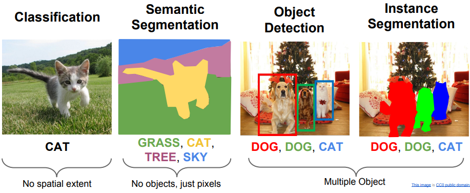

Instance segmentation is done by adding an Unet after faster rcnn. Mask RCNN is one such example.

# References
1. [Deep Learning by Ranjay Krishna and Aditya Kusupati](https://courses.cs.washington.edu/courses/cse493g1/23sp/schedule/)
2. [Machine Learning CSE 446 UW](https://courses.cs.washington.edu/courses/cse446/22au/)
