

Table of Contents

## Table of contents
There will be a lot of content in this markdown file. Please use the github's interactive navigation. (Too lazy to write/generate TOC)

# Introduction
## What is Machine Learning
Fancy way
> A computer program is said to learn from experience E with respect to some task T and some performance measure P, if its performance on T, as measured by P, improves with experience E. 
—Tom Mitchell, 1997

I would say its just making a machine learn using data so that it can apply its learning on unseen data.
## Types of Machine Learning1
### Based on human supervision
1. Supervised Learning 

If the training data has labels, it is supervised.

2. Unsupervised Learning 

Machine trained without labelled data.

3. Semisupervised Learning 

Only a few samples of the data is labelled. The machine learns to label the unlabelled samples. Example is a photo-hosting service like Google Photos.  Once
you upload all your family photos to the service, it automatically recognizes that the
same person A shows up in photos 1, 5, and 11, while another person B shows up in
photos 2, 5, and 7. This is the unsupervised part of the algorithm (clustering). Now all
the system needs is for you to tell it who these people are. Just one label per person,4
and it is able to name everyone in every photo, which is useful for searching photos.

4. Reinforcement Learning 

The learning system, called an agent
in this context, can observe the environment, select and perform actions, and get
rewards in return (or penalties in the form of negative rewards). It
must then learn by itself what is the best strategy, called a policy, to get the most
reward over time. A policy defines what action the agent should choose when it is in a
given situation.
### Batch vs Online Learning
In batch learning, the system must be trained
using all the available data. This will generally take a lot of time and computing
resources, so it is typically done offline. First the system is trained, and then it is
launched into production and runs without learning anymore; it just applies what it
has learned. This is called offline learning.

In online learning, you train the system incrementally by feeding it data instances
sequentially, either individually or by small groups called mini-batches. Each learning
step is fast and cheap, so the system can learn about new data on the fly, as it arrives. One important parameter of online learning systems is how fast they should adapt to
changing data: this is called the learning rate. If you set a high learning rate, then your
system will rapidly adapt to new data, but it will also tend to quickly forget the old
data (you don’t want a spam filter to flag only the latest kinds of spam it was shown).
Conversely, if you set a low learning rate, the system will have more inertia; that is, it
will learn more slowly, but it will also be less sensitive to noise in the new data or to
sequences of nonrepresentative data points (outliers).

### Generative vs Discriminative Models
A Discriminative model ‌models the decision boundary between the classes (conditional probability distribution p(y|x)). A Generative Model ‌explicitly models the actual distribution of each class (joint probability distribution p(x,y)). In final both of them is predicting the conditional probability P(Output | Features). But Both models learn different probabilities. In Math, 

Training classifiers involve estimating f: X -> Y, or P(Y|X)

Generative classifiers 
* Assume some functional form for P(Y), P(X|Y)
* Estimate parameters of P(X|Y), P(Y) directly from training data
* Use Bayes rule to calculate P(Y |X)
* Naïve Bayes, 
Bayesian networks, 
Markov random fields, AutoEncoders, GANs.

Discriminative Classifiers.

* Assume some functional form for P(Y|X)
* Estimate parameters of P(Y|X) directly from training data
* ‌Logistic regression, SVMs, ‌CNNs, RNNs, Nearest neighbours.

### Parametric vs Non-parametric Models
A paramter is something that is estimated from the training data and change (learnt) while training a model. They can be weights, coefficients, support vectors etc.

A parametric model summarizes data with a set of **fixed-size** parameters (independent on the number of instances of training). Parametric machine learning algorithms are which optimizes the function to a known form. 
For example, we already assume the function is linear in linear regression. If y = b0 + b1\*x, we fixed parameters to b0 and b1 and these are learnt while training. Examples include: Logistic Regression, linear SVM (wTx + b = 0), Linear Discriminant Analysis, Perceptron, Naive Bayes, Simple Neural Networks.

A Nonparametric models are those which do not make specific assumptions about the type of the mapping function. They are prepared to choose any functional form from the training data, by not making assumptions. The word nonparametric does not mean that the value lacks parameters existing in it, but rather that the parameters are adjustable and can change. 
For example, in k-nearest neighbors' algorithm we make predictions for a new data instance based on the most similar training patterns k. The only assumption it makes about the data set is that the training patterns that are the most similar are most likely to have a similar result. Examples include: k-Nearest Neighbors, Decision Trees, SVMs.
## Maximum Likelihood Estimation
In one line, MLE is a method that determines values of the parameters of a model such that they maximise the likelihood of observed data given a probability distribution. In simpler terms, say we have a random sample of data from some gaussian distribution. We need to find out which gaussian curve (need to find mean and variance) is most likely responsible for creating our data sample. We use MLE to find the parameters mean and variance.

Say we have a random sample from a sequence of coin trails (H,H,T,T,..) from a binomial distribution with k heads out of n flips. Let us assume there is a parameter $\theta$ which is probability of getting heads. W.K.T, the probaility distribution of the data with a fixed unknown parameter $\theta$ is represented by, 

$$ P(D|\theta) = \theta^k\*(1-\theta)^{(n-k)} $$

MLE helps us find $\theta$ which maximises the probability of obtaining the data that we saw.

$$ \hat{\theta}\_{MLE} = \arg\max_{\theta} P(D|\theta) $$

In the above eqn, arg max means the value that returns the maximum value of a function. (Say we have a function, f(x) = x + 10 where x is in range \[1,5]. Max of the fn will be f(5) = 5 + 10 = 15. But arg max would be 5 beacuse that is the value that returned max value of function.)

We will consider log likelihood as it is easy for calculation. Log function is monotonically increasing function which means the arg max would be same for with log or without log.

$$ \hat{\theta}\_{MLE} = \arg\max_{\theta} \log P(D|\theta) = \arg\max_{\theta} \log \theta^k*(1-\theta)^{(n-k)} $$

We know that derivative is zero at maxima and minima. So we need to find at which $\frac{d}{d\theta} \log P(D|\theta) = 0$. Calculating, we will get $\theta = \frac{k}{n}$.

## Linear Regression
It is a parametric model where we assume our data is linear i.e our output y(house price) is a linear function of feature x(sq.ft). There might be d number of different features like sq.ft, no.of rooms, etc and we represent number of samples in training data with n. As we assume the data is linear, w.k.t y = mx where m is our paramter which is our slope. We represent the parameter/weight with w. So for each sample in our data, y = wx. The error in our model is represnted with e. A loss/cost/objective function is used to know this error. We optimize this loss function to get the least error. 

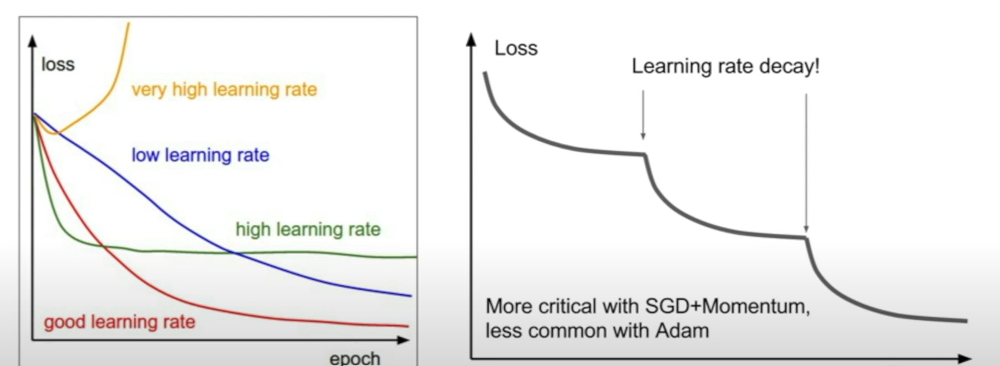

Linear Regression has a closed form solution i.e we have a formula to get to a solution without any iterative approaches of trail and error like gradient descent. We can find this solution by taking arg min of loss function because we need to find the weight which will minimize the loss function. Commonly we use Least Squares as the loss function.

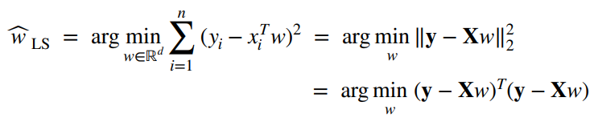

We can take derivative to find the minimum and we will obtain:

$$ \hat{w}\_{LS} = (X^TX)^{-1}X^Ty $$

> Least squares is preffered over absolute values because, LS is differentiable which is a necessity for gradient descent approaches. But more importantly, least squares closed form solution is equal to MLE closed form.

But data is not always linear, we then use polynomial regression to fit to the data.

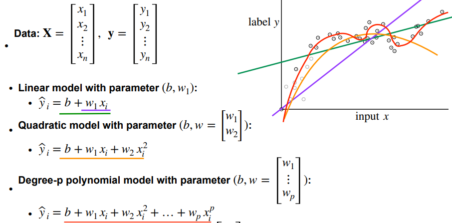

The more the degree of the polynomial the better is the fit but the more is the issue of overfitting.
# Core Concepts
## Bias-Variance Tradeoff
Bias is the difference between the average prediction of our model and the correct value which we are trying to predict. The more bias means more error as the model(usually very simple models) couldn't properly fit to the data which is called underfitting. Variance is the variability of the model prediction and it tells about the spread of the data. Model with high variance (usually a complex model) pays a lot of attention to training data and fits almost exactly. When we use model with high variance on unseen data, the model couldn't generalize/adapt to the new data has it is too rigid and fixed with training data. This is called over-fitting. We desire low bias and low variance for our model to generalize well.

To summarize, if the model is simple(less complex), there will be more bias but generally less variance and if the model is too complex, there will be less bias but more variance. To choose the best model, there is a tradeoff between bias and variance to decrease the overall error given by 

$$ Total Error = Bias^2 + Variance + Irreducible Error $$

One popular way of talking about model complexity is **Occams Razor** which says “Everything should be as simple as it can be, but not simpler".
## Cross Validation
To get the accurate measure of how well model works, its important to have take some data out before training of model and use this unseen data to test the data. Often, 80% of the data is set for training and 20% for testing. Instead of putting all faith in the test data, we can use cross validation to cross check the model performance and more importantly to tune hyper-parameters.

> Hyper-parameters are parameters that are fixed before training the model. They are not learnt but instead guessed with trail and error like batch size, number of neighbors in knn etc..

Cross-validation is a process of taking some data out called validation data and train the model without validation data. Test the trained model using the validation data. Now change the hyper parameters and repeat process again to get best hyper-parameters as well know model performance.

There are various forms of cross validation. 
1. K-fold CV

The most popular one. We randomly split the training data into k splits. Eachtime we take one split of k splits as validation data and train the model on remaining splits and note the error. Now take another split into validation data and repeat the process. Finally take the average error as the overall error of the model. 

2. Leave One Out (LOO) CV

Same as k-fold but each split will only have a single sample of the data. It gives an unbiased estimate of the error but computationally expensive and time taking.

3. Stratified CV

What if our random split contains same label of the data. This means our split is not a proper estimate of the training data. This testing our model on this data doesn't give a true estimate. So many prefer stratified cv where each fold has roughly the same proportion of target classes as the original dataset. For example: If we have a binary classification problem with 80% positive examples and 20% negative examples, stratified CV ensures that each fold of the CV also contains roughly 80% positive and 20% negative examples.
### Hyper Parameter Tuning
We have several methods to test different hyper-parameters. These methods are used along with cross validation to get true estimate of a hyper-parameter.

1. Grid Search CV

It involves defining a grid of possible hyperparameter values and then systematically evaluating the performance of the model for each combination of hyperparameters in the grid. For example, we define following `C_values = [0.1, 1, 10], kernel_values = ['linear', 'rbf', 'poly']` for SVM. Gridsearch will try all combinations (9 for example). As we can see, this method is slow and computationally expensive.

2. Random Search CV

We give a range of values for each hyper parameter. We randomly select values from the search space for each hyperparameter and use them to train and evaluate the model. We can set the number of iterations or trials to perform, and in each iteration, we randomly select a value for each hyperparameter of interest from its search space. This is fast but not accurate as it is random.

3. Bayesian Optimization
In contrast to random or grid search, here we keep track of past evaluation results which the optimization use to form a probabilistic model mapping hyperparameters to a probability of a score on the objective function: P(score|hyperparameters). It starts with a few random combinations but it chooses next set of parameters by analyzing the results from previous chosen parameters.
## Evaluation Metrics
### Root Mean Square Error
It is a commonly used evaluation metric in regression tasks. It measures the square root of the average squared difference between the predicted values and the true values.

$$ RMSE = \sqrt(1/n * \sum((y_{pred} - y_{true})^2)) $$

RMSE is preffered over Mean Absoulte Error (MAE) because RMSE penalizes large errors due to squaring but MAE treats all error same.
### R squared
as the coefficient of determination, is a statistical measure that represents the proportion of the variance in the dependent variable (i.e., the target variable) that is explained by the independent variables (i.e., the features) in a regression model. In other words, it represents how well our regression model fits the given data. R-squared is a value between 0 and 1, where 0 indicates that the model does not explain any of the variability in the dependent variable, and 1 indicates that the model explains all of the variability in the dependent variable.

We first calculate variance(sum of squared residuals) along the mean of the data and later calculate variance along the new model line that is fitted to the data.

$$ R^2 = \frac {Var(mean)-Var(fitted_line)}{Var(mean)} $$
### Confusion Matrix
Used for classification tasks. In a confusion matrix, `True Positives` are the *positive* samples that are predicted as **positive**, `False Positives`(also called **Type 1 errors**) are the *negative* samples that are predicted as **postive**. Similarly `True Negatives` are the *negative* samples that are predicted as **negative**, `False Negatives` (Type 2 errors) are the *positive* samples that are predicted as **negative**.
### Accuracy
It is calculated as the number of true positives and true negatives divided by the total number of instances in the dataset. In most of the cases, the distribution of classes is imbalanced, meaning that some classes have far fewer instances than others. In such cases, a classifier that always predicts the majority class will have a high accuracy, even though it is not very useful. So just accuracy is not good enough estimate.
### Precision, Recall and F1 Score
Precision says From total predicted positives, how many are actual postives. $Precision = \frac{True Positives}{True Positives + False Positives}$. Precision means percentage of the results that are relavant.

Recall says From total positives how many are actual positives. $Recall = \frac{True Positives}{True Positives + False Negatives}$. Recall means the percentage of total relevant results that are correctly classified.

Lets consider we are doing a medical test. Diagnoizing a disease is high priority. We have to take care of positive tests marked as negative (False Negative). We can for an extent misdiagnoize a negative test as positive (False Positive). Here Recall is preferred over Precision.

Say we are doing email spam detection. We can not mark a normal mail as spam (False Positive) but we can for an extent mark a spam mail as normal(False Negative). Here Precision is preferred over recall.

If we don't know what to prefer over precision and recall, F1 score is used as it is a **harmonic mean of both**. $F1 Score = \frac{2* Precision * Recall}{Precision + Recall}$.
### Mean Average Precision (MAP)
MAP stands for Mean Average Precision, which is a common evaluation metric used in information retrieval and object detection tasks. MAP measures the average precision at different recall levels.

For example, suppose the search engine retrieves 20 documents for the "machine learning" query. We evaluate the precision and recall of the search engine at different recall levels by examining the top 5, 10, and 20 retrieved documents.

Suppose we find that the search engine correctly retrieved 2 out of the 5 relevant documents, 5 out of the 10 relevant documents, and 8 out of the 20 relevant documents. We calculate the precision at each recall level and then take the average to obtain the MAP for the "machine learning" query.

For example, the precision at recall level 5 is 0.4, the precision at recall level 10 is 0.5, and the precision at recall level 20 is 0.4. We take the average of these values to obtain the MAP for the "machine learning" query, which in this case is 0.433.
### Area Under Curve (AUC)
It is used in binaru classifiers. True Positive rate(TPR) is the number of positives correctly classified out of all positives (TP/(TP+FN)) and False Positive rate(FPR) is number of negatives classified as positives out of all negatives (FP/(TN+FP)). Receiver Operator Characteristic (ROC) curve is plotted with FPR on X-axis and TPR on Y-axis and the curve is determined by threshold. 

Say we have a binary classification problem of yes and no. We set a threshold(0.5) above which we classify something as yes and below the threshold as no. We train a logistic regression and we calculate TPR and FPR for this. If TPR=1 and FPR=0, it is a perfect classifier. If TPR=1 and FPR=1, then it is a random classifier. We plot the point on the graph. Now we can change the threshold and plot the calculated values of TPR and FPR again. We repeat this process for several thresholds to get ROC curve which shows us the best threshold. 

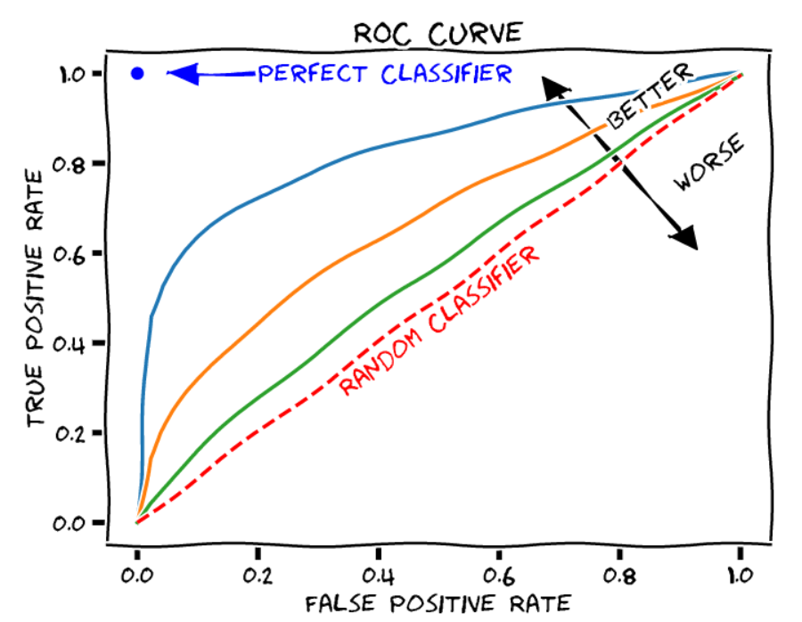

We can change the model now to say Random Forest and plot the ROC curve. We can find the areas of both ROC curves. The more the area the better the model.

AUC-ROC provides a useful summary of the classifier's performances, and can also help us to choose the optimal threshold for our specific problem.
## Gradient Descent
What to if we **dont have a closed form solution** like linear regression? This is where iterative approaches come into play. Lets have a look at convexity first.
### Convexity
Convexity is a mathematical property of a function, and it plays an important role in optimization problems. A function is said to be convex if its graph lies entirely above or on a line connecting any two points on the graph. Intuitively, this means that the function curves upward or is flat, and does not curve downward. 

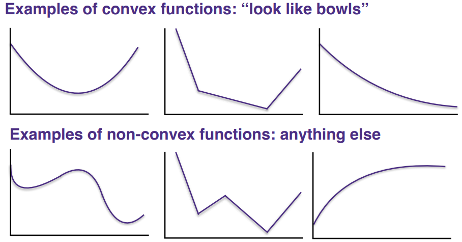

More formally, $f((1-\lambda)x+\lambda y)\le (1-\lambda)f(x)+\lambda f(y)$ .This inequality essentially states that the value of the function f(x) is always above or on the line connecting any two points on its graph.

Why care convexity?
* All local minimum in convex functions are global minima.
* Efficient to optimize.

If our loss functions are convex functions, we have to find the minima of the function to find the minimum parameter where loss is less. If these functions are non-convex, there might be multiple minima. So we reach a local minima, we might assume it is the global minima.
### GD
Gradient descent is an optimization algorithm used to minimize a function by iteratively adjusting the parameters in the direction of steepest descent of the function.

In gradient descent, we start with an initial guess (random) for the parameters (w) of the function(loss/cost fn) we want to optimize. We then calculate the gradient of the function with respect to the parameters, which tells us the direction of the steepest ascent. To minimize the function, we move in the opposite direction of the gradient, i.e., in the direction of steepest descent.

The size of each step we take in the direction of steepest descent is controlled by a parameter called the step size/learning rate($\alpha$). If the learning rate is too small, the optimization process can be slow, while if it is too large, the process can be unstable and diverge.

We continue this process of computing the gradient and adjusting the parameters until we reach a point where the gradient is close to zero, i.e., we have found a local minimum of the function. This point is the optimal set of parameters that minimize the function.

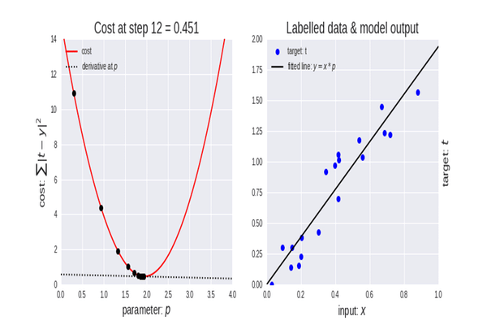

$$ w_t \leftarrow w_t - \alpha\frac{\partial L(w)}{\partial w_t} $$
### Batch/Vanilla GD
Vanilla is just a fancy term used for saying something basic without additional features. We will consider our loss function explicitly as $L(w) = \frac{1}{2} (w^Tx - y)^2$. Using half for ease of calculation. If we calculate the gradient of this loss function we will get $\frac{\partial L(w)}{\partial w_t} = (w^Tx - y)x$. We can use this value in the gradient calculations.

In batch gradient descent, the gradient is computed over the entire training set at each iteration. This can be computationally expensive for large datasets, but it leads to a more accurate estimate of the true gradient.

for t=1,...T do

$w \leftarrow w + \alpha\Sigma_{i=1}^n (y^i - w^Tx^i)x^i$

return w
### Stochastic/Incremental GD
The gradient is computed on a single training example at each iteration. This can be faster and more memory-efficient than batch gradient descent, but it can lead to a noisy estimate of the gradient, which can make it difficult to converge to the optimal solution. Difference in Stochastic and Incremental is, we randomize the data point in SGD and don;t randomize in Incremental. Below is logic for incremental as i is not randomize.

for t-1,...T do

  for i=1,...n do

$w \leftarrow w + \alpha(y^i - w^Tx^i)x^i$

return w

### Mini-Batch GD
the gradient is computed on a small random subset (mini-batch) of the training set at each iteration. This combines the advantages of batch gradient descent and stochastic gradient descent, as it is more efficient than batch gradient descent while providing a less noisy estimate of the gradient than stochastic gradient descent. We divide the data, D into partition of $D_1,D_2,..D_k$ similar to k-fold with equal size in folds.  

for t-1,...T do

  for l=1,...k do

$w \leftarrow w + \alpha\Sigma_{i\in V_l} (y^i - w^Tx^i)x^i$

return w

### Coordinate Descent
The goal is still the same, we need to get minimum parameter, w that minimizes the loss function. But when we have a lot of coordinates (multivariate function/multiple features), it becomes difficult to minimize w in all coordinates, so we choose only one coordinate to minimize.

for t-1,...T do

  Choose a random coordinate, c from $x_1,x_2,..$ or loop through a list of values
  
$w \leftarrow min L(w)$

return w

We randomly choose a coordinate and try to minimize weights/paramter only in that coordinate. All other coordinate's parameter will be fixed. Thus we are only optimizing a single coordinate at a time. There is no learning rate/step size in coordinate descent. 

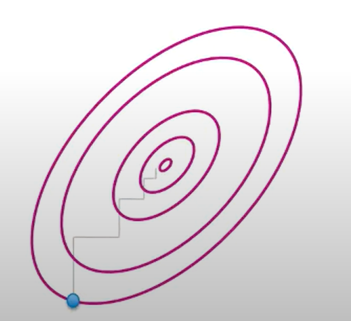

In the above convergence plot, there are two co-ordinates say $x_1,x_2$ plotted in X and Y-axis respectively. We start with optimizing at $x_2$ and then $x_1$ and then $x_2$ and so on till we reach convergence.

The advantage of coordinate descent is that it can be efficient when the function to be optimized has some structure that makes it separable in terms of the variables like lasso regression. In other words, when the function can be expressed as a sum of functions, each depending on a single variable. In this case, coordinate descent can converge more quickly than other optimization methods.

However, coordinate descent can be slow when the variables are highly correlated or when the function is not separable.
## Advanced GD
### GD Pitfalls
Not all convex functions are good for GD. There are non-smooth functions which have sharp corners where function is not differentiable.
> The derivative of a function at a point is defined as the slope of the tangent line to the function at that point.

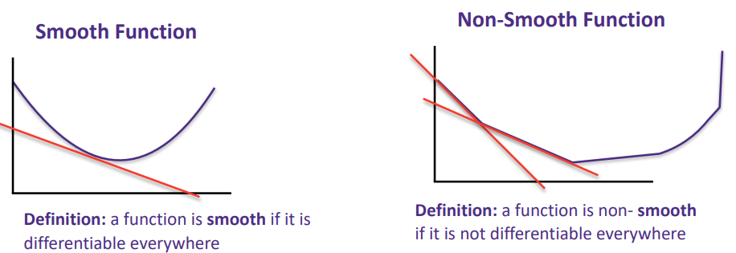

A subgradient is the gradient at a point on the function. At the sharp corners, there can be multiple tangents leading to multiple subgradients at a single point. This makes convergence go crazy.

Other two main challenges with Gradient Descent are local minima's, saddle points and plateau. 

If the random initialization starts the algorithm on the left, then it will converge to a local minimum, which is not as good as the global minimum. If it starts on the right, then it will take a very long time to cross the plateau (flat regions), and if you stop too early you will never reach the global minimum. 

Saddle points are not local minima. They are the points where in one direction loss goes up and in other loss goes down making graident at the point zero. But the point is not local or global minima. Our GD can't get out of saddle point regions.

Most of these pitfalls are common for deep learning models as we have large number of dimensions involved in optimization. So most of the below discussed optimizations are used in deep learning.
### SGD with Momentum
This is a technique used to accelerate the convergence of the optimization process by adding a fraction of the previous gradient to the current gradient estimate. The idea is to allow the optimization algorithm to build up speed in directions that have consistent gradients and to dampen oscillations in directions with inconsistent gradients thus passing local minima with velocity gathered from rolling down the hill. Similarly crossing saddle points and plateau (flat regions).

Specifically, at each iteration of the SGD algorithm with momentum, the gradient is computed on a small subset of the training data (a mini-batch), and then a "velocity" vector is updated by adding a fraction (the momentum coefficient or $\rho$) of the previous velocity vector to the current gradient estimate. The parameters of the model are then updated by subtracting the updated velocity vector from the current parameter estimate.

The momentum coefficient is typically set to a value between 0 and 1, usually 0.9 with higher values leading to more momentum and faster convergence, but potentially overshooting the optimal solution.

for t=1,...T do

  for i=1,...n do

$v \leftarrow = \rho v + (y^i - w^Tx^i)x^i$

$w \leftarrow w + \alpha v$

return w

But, we if observe we have two hyperparameters now, $\rho$ and $\alpha$. They need tuning to get the best results.
### AdaGrad
AdaGrad, which stands for Adaptive Gradient, is an optimization algorithm that is designed to automatically adapt the learning rate during training. 

During training, AdaGrad maintains a set of per-parameter gradient accumulators, which are initialized to zero. At each iteration, the gradient of the loss function with respect to the parameters is computed, and the accumulated sum of the squared gradients for each parameter is updated as follows: $grad accumulator += gradient^2$. The parameter is calculated as:

$$ parameter -= \frac{initial learning rate}{\sqrt{grad accumulator} + offset to avoid zero}* gradient $$

The negative sign is turned into positive by the gradient (negative gradient means going down the slope). The initial learning rate is generally set to 0.1 or 0.01 but it doesn't matter because it is adaptively scaled. Adagrad even address issue in higher dimensional space where one parameter converges faster than the other.

In Adagrad, as the gradient decreases, the step size keeps decreasing as we approach convergence which is useful in convex but if there is a saddle point or flat, then the optimization becomes super slow.
### RMSProp
This is an updated version of Adagrad.

$$ grad acc = decay rate * grad acc + (1 - decay rate) * gradient^2 $$

$$ parameter -= \frac{initial learning rate}{\sqrt{grad accumulator} + offset to avoid zero}* gradient $$

The first line of the update rule computes the moving average of the squared gradients using an exponential decay, which is a hyper-parameter usually set to 0.9. This effectively scales down the learning rate for parameters with large gradients and scales up the learning rate for parameters with small gradients. Thus giving us smoother convergence.
### Adam
Perhaps the most used optimizer for neural networks. Adam, short for Adaptive Moment Estimation, is a popular optimization algorithm in machine learning that combines ideas from both RMSprop and momentum-based gradient descent. It is an adaptive learning rate optimization algorithm, which means it adjusts the learning rate of each parameter based on the history of the gradients for that parameter. 

The Adam algorithm maintains a set of exponentially decaying average of past gradients and past squared gradients for each parameter. The decaying rate of the averages is controlled by two hyperparameters, $\beta_1$ and $\beta_2$, which are typically set to 0.9 and 0.999, respectively. The average of past gradients is used to calculate the momentum term, while the average of past squared gradients is used to calculate the scaling term. These two terms are then combined to obtain the update for each parameter.

Say the computed gradient of loss function be $dx$ and first and second moment are set to zero initially.

$$ first moment = \beta_1\*first moment + (1-\beta_1)\*dx $$

$$ second moment = \beta_2\*second moment + (1-\beta_2)\*dx\*dx $$

$$ parameter -= \frac{\alpha*first moment}{\sqrt{second moment} + offset} $$

Adam also includes a bias correction mechanism that corrects for the fact that the estimates of the first and second moments are biased towards zero, especially in the early stages of training when the estimates are very inaccurate.
# Regularization Models
## Ridge Regression (L2)
For a linear model, $y=b+ w_1x_1 + w_2x_2 + ... + w_dx_d$. If model overfits, then w is large thus small changes in x will make the model vary a lot. So by limiting weights, we can improve model generalization. W.K.T, loss/cost function is to find minimum weights, w such that loss is the least. In ridge regression (also called shrinkage method), we use a regularizer $||w||^2_2$ (l2-norn) to control weights.

$$ \hat{w}\_{ridge} = \arg\min_{w} \Sigma_{i=1}^n (y_i - x_i^Tw)^2 + \lambda||w||\_2^2 $$

where $\lambda$ is a regularization coefficient. More the value more the regularization.

$$ \hat{w}\_{ridge} = (X^TX + \lambda I)^{-1}X^Ty $$
## Lasso Regression (L1)
Lasso (Least Absolute Shrinkage and Selection Operator) is similar to ridge, except uses L1 instead of L2 norm.

$$ \hat{w}\_{lasso} = \arg\min_{w} \Sigma_{i=1}^n (y_i - x_i^Tw)^2 + \lambda||w|| $$

Unlike ridge where the model can shrink the values close to zero, lasso can shrink the weights to zero making the model sparse. Thus eleiminating the features that are not necessary. 
## Elastic Net Regression
This is a combination of L1 and L2. In this regularization coefficient looks like,

$$ \lambda L1 + (1-\lambda)L2 $$
# Classification Models
## Logistic Regression
Similar to linear regression except the target is categorical instead of continous (so its not exactly regression problem). Input of logistic can be continous or categorical. The model aims to categorize the input samples into classes. The decision boundary is linear. The main difference from linear regression is the loss function.
### Loss Functions
#### 0-1 Loss
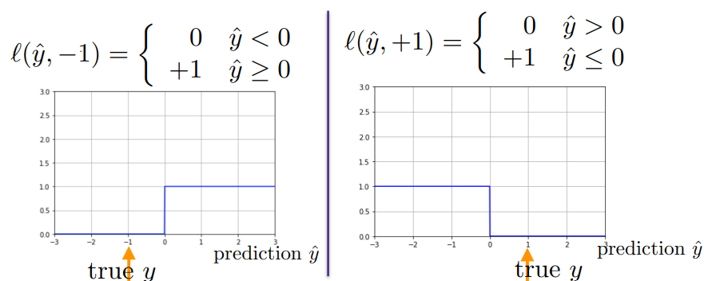

This is the ideal loss function. If we make a correct prediction, loss is 0 and wrong prediction gives loss 1. But we can't use this, as the loss function is not convex so can't be optimized.
#### Quadratic Loss
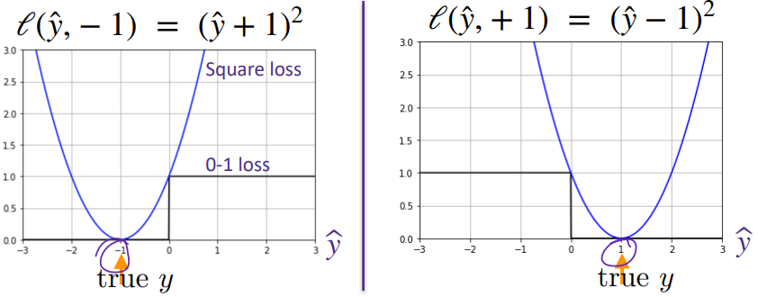

Similar to loss function used in linear regression. If observed, we get high loss even if we predicted correctly. See the left side parabola increasing loss when it should be 0. 
#### Sigmoid Loss
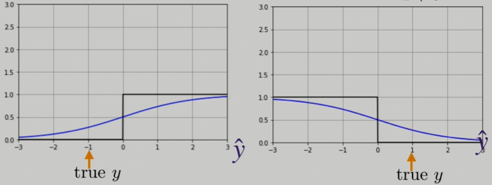

$$ l(\hat{y},y) = \frac{1}{1+e^{y\hat{y}}} $$

This is a differentiable approximation of 0-1 loss. The edges of funtion is flat which makes gradients long time to converge.
#### Logistic Loss

$$ l(\hat{y},y) = 1+e^{-y\hat{y}} $$

Resoles all our issue. Thus quite popular choice.

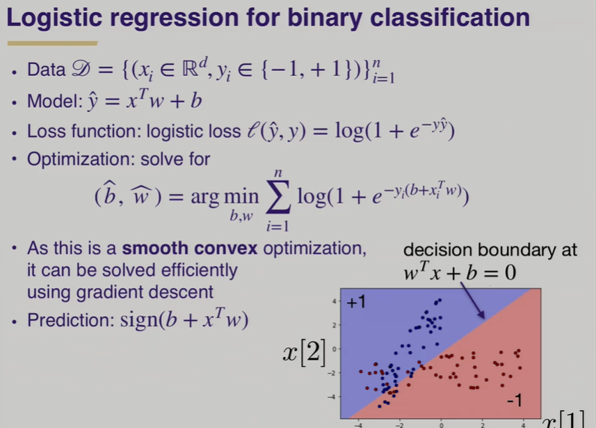

## Support Vector Machines
To choose a best linear classifier to seperate say two classes, how should the decision boundary be? Should the decision boundary be close to class A or class B. Ideal boundary will be far from the both classes because small change should change the output drastically thus making the model more generalizable. In a 2D case, decision boundary is a line and in higher dimensions it is a hyperplane. The distance is measured from a point in each class which are nearest to the hyperplane. So only the points closest to the hyperplane matter in finding the decision boundary. Those points from each class are called support vectors. The distance from a point i is measured by:

$$ d = \frac{y_i (w^Tx_i + b)}{||w||\_2} $$

What if the data is not linearly seperable (for higher dimenions)?

One get away method is to introduce a slack where we ignore few points while optimizing the distance. A better way is to lift the features to higher dimensions (kernel method). The general idea is that making a non seperable 2D features to a 3D features making them seperable. Say we have X1 and X2 features, we can apply non linear transformation to make it 3D. For example, X1 and X2 can be transformed to \[X1^2, X1X2, X2^2] with degree 2 and can increase further dimensions by using features like X1^2+X2^2. But its hard to know which feature map will work to get linearly seperable feature space. Also if we go to much higher dimensions, we can not use entire feature space as it requires a lot of memeory. This is where kernels trick helps. 
### Kernel Trick
The kernel trick overcomes this limitation by implicitly mapping the original feature space into a higher-dimensional space using a kernel function. Before jumping in details lets provide some context. 

Say we have n samples(rows) of data and p features (columns). In general we expect n >> p but in many real world problems it is the opposite like number of pixels in image is much greater than number of images. In machine learning problems we will be handling size of np (size of x). If $p >> \implies np >> n^2$. Now we have something called dual formation which is an alternative approach of minimizing loss function where we only need to solve $x^Tx'$ where x and x' are two different data points. This dot product requires n^2 dot products instead of np which is more optimized. Which means when we go to higher dimenions, we don't need to explicilty store the values of \[X1^2, X1X2, X2^2] but we only need the dot products between the data points. So when we go to higher dimensions, we first *explicitly* transform the the np data to nP(P>>p higher dimenions transformation) and then calculate dot products T(x).T(X') (n^2) to use in our loss functions. The route is $np \rightarrow nP \rightarrow n^2$.

As we can see nP is too large to store due to higher dimensions. We need an alternative route to reach T(x).T(x')  from x.x' without using nP. This is where kernel trick comes. It starts with np and then calculate the original dot products n^2 and then using kernel function it transforms original dot product to transformed dot products (n^2). The route here is $np \rightarrow n^2(original) \rightarrow Kernel function \rightarrow n^2(transformed)$. Kernel function computes the similarity or inner product between pairs of data points in the higher-dimensional space, without explicitly calculating the coordinates of those points.  Thus everytime if we want to do a dot product we can do a kernel function and use it implicitly. See below where we have different kernel functions and how they use original data points dot products but *implicitly* gives the transformed dot products. 

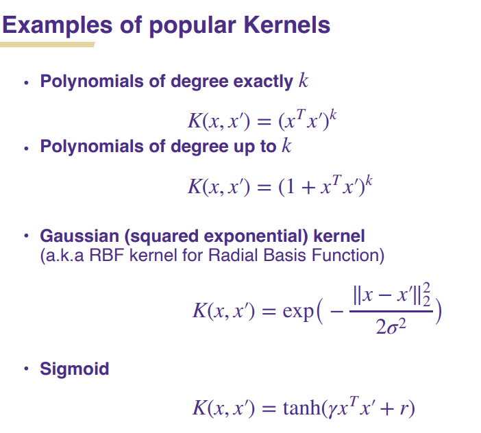

Note: Though we cant see the dot product in RBF kernel, if we break down the norm, we get a dot product for infinite dimensions projection! The sigma is a hyperparameter which determines how rigid or smooth our hyperplane looks.

Watch this video for a great visual explanation: https://www.youtube.com/watch?v=Q7vT0--5VII
## Naive Bayes
Like the name mentioned, this model is based on the Bayes theorem and conditional probabilities. We will look into Multinominal Naive Bayes first. Since the model is mainly used for text based classifications, will take an example of classifying a message as spam or normal. Training data will look like this:

|Occurence of word 'Money'|'Hello'|'Dear'|Label|
|--|--|--|--|
|5|2|0|Spam|
|0|1|2|Normal|

Say we have a message 'Hello Money'. We need to calculate P(Spam|Hello, Money) and P(Normal|Hello, Money). Based on the probablities we decide the output label. We will take P(Spam|Hello, Money) for calculation. From applying Bayes theorem at every step below,

$$ P(Spam|Hello, Money) = \frac{P(Spam, Hello, Money)}{P(Hello, Money)} $$

$$ P(Spam, Hello, Money) = P(Hello | Money, Spam)P(Money, Spam) $$

As we know by doing bayes $P(Money, Spam) = P(Money|Spam)P(Spam)$,

$$ P(Spam, Hello, Money) = P(Hello | Money, Spam)P(Money|Spam)P(Spam) $$

We do a **naive** assumption that features are independent i.e word Money is independent of word Hello (order of occurence of these words is not important). Thus even if the message is very large, we can ignore all the complex calculations.

$$ P(Spam, Hello, Money) = P(Spam)\*P(Hello|Spam)\*P(Money|Spam) $$

This is the only formula we need to calculate output label. To do a prediction for a new sample, say Hello Money Money will calculate two probabilities as `P(Normal Message)*P(Hello|Normal)*P(Money|Normal)^2` and `P(Spam Message)*P(Hello|Spam)*P(Money|Spam)^2`. Whichever probability is higher decides the output.

### Gaussian Naive Bayes
Now for the Gaussian Naive Bayes (features are continous unlike nominal as above), the algorithm is as follows:
1. Lets take an example of outputs being buys a ticket or doesn't buy a ticket. Let the features be distance of theatre, price of ticket,..
2. Firstly, prior porbabilites, P(Buys) and P(Doesn't Buy) are calculated similar to above case.
2. From the samples, a gaussian distribution is plotted for every feature given buys a ticket and doesn't buy a ticket i.e from data, for all 'distance' samples where a person buys a ticket, we plot normal distribution using mean and std from the data and similarly for all 'distance' samples where a person doesn't buy ticket, we plot normal distribution and we repeat this for all features. 
3. To do a prediction for a new sample, we calculate probabilities as 

$$ P(Buys Ticket|distance=value,price=value) = P(Buys Ticket)\*P(distance=value|Buys Ticket)\*P(price=value|Buys Ticket) $$

Except for prior probabilties, other probabilties are likelihoods calculated from gaussian distribution we plotted. Likelihood is the y axis value at X-axis (price or distance = given value).

5. Sometimes the above probabilities are calculated in log scale to prevent underflow (if likelihood is nearly zero, the system can't represent such a small value) as log scale turn product to addition.
6. Similarly we calculate the probability of not buying ticket and compare the value.

6. Sometimes the model can even be used to find the most important features from the distribution plots if the features differs a lot.
## K-NN
K Nearest Neighbors is a non parametric model that can be used for both classification and regression. 
1. Given a new, unseen input feature vector, the algorithm identifies the k nearest neighbors to that vector in the training dataset. "k" is a user-defined parameter that determines the number of neighbors to consider.
2. The distance metric (e.g., Euclidean distance or Manhattan distance) is typically used to measure the distance between the new input vector and the training instances.
3. The majority class label (for classification) or the mean/median of the target values (for regression) among the k nearest neighbors is then assigned as the predicted label or target value for the new input vector.

The key idea behind the KNN algorithm is that similar instances are likely to have similar labels or target values. By considering the labels or target values of the k nearest neighbors, the algorithm makes predictions based on the local structure of the data. Remember to pick od number of k to avoiding tie between categories, scale the features (normalize) first as this is a distance based algorithm and for categorical features, appropriate distance metrics (such as Hamming distance or Jaccard similarity) need to be used instead of Euclidean or Manhattan distance.
# Tree Methods
## Decision Trees
Tree methods are the best choice for the tabular data. Lets see how they work.
1. Decision trees start with the root and have Nodes (decisions). Each of these nodes can again have nodes. The node without any following nodes (children) is called a leaf.
2. Imagine we have a dataset with features 
3. Each of these node decisions are decisions taken on a feature of the dataset (Hates Rose<--(left is no)loves Titanic(right is yes)-->Loves Rose). Generally the leaves are output.
4. If there are multiple features, to decide which feature goes first on the tree, following method is used (**Gini Impurity**).
    * Each feature is soley used to predict the outcome. Say the outcome is Buys ticket or doesn't buy. Feature be, Likes Actor (Yes or No). 
    * Out of all samples, number of yes and no in output is calculated for liking actor and not liking actor.
    * Which means each children (leaf) of this node will have a number of yes and no.
    * Gini Impurity for each leaf is calculated as $1-(Probability of Yes)^2-(Probability of No)^2$.
    * Total gini impurity of the node is calculated by averaging impurity of each leaf.
    * If the number of samples on each of the leaf is not equal take the weighted average of each leaf and do average for node i.e `Weighted avg of each leaf = (Number of samples in leaf/Total samples in the node)*gini impurity of the leaf`.  

    What if the feature has numeric data?  
    * Let the feature be distance of theatre. Sort that column and then calculate avergae of each of the adjacent cells and calculated gini impurity.
    * For example, let the sorted values be 7,12,18,35,38. Calulating avg of each adjacent cell gives 9.5,15,26.5,36.5.
    * Each node will be like Distance < 9.5, then each of the leaf will have outputs yes and no. Then calculate gini impurity for this node.
    * Repeat the above step for all 15,26.5,36.5 and decide the best value.
    * This best value node, Distance < 15 will compete with other features like, likes actor to be decided to go first.
4. Now we will have one feature decision as the root. If the children of this root have any impurity i.e few Yes and few No (Pure means full yes or full no), then that children will become a Node and step 3 is repeated again till we reach a node that is pure.
5. If the node is pure then it becomes a leaf.
6. If the leaf has No, then the decision is Doesn't buy ticket and vice-versa.

What if the output is a regression value?  
1. Choosing a feature is done by gini impurity but instead of taking yes and no probability, we take squared residual errors. 
2. Say distance be a feature and price be output. If distance < 3, the children will be Price = (Average outputs in data when distance is less than 3) and other children will other end average.
3. Each children gini impurity is calculated by `(Average - Actual price)^2` for each sample and add all to get impurity of that leaf.
4. Thus choose a distance < value, such that value gives least residual errors.
5. Compare this way for all other features to choose root.
6. The root's children will become a leaf if there is no further reduction. This will create a leaf for each sample. To avoid this we will set a parameter ex:7 which means if a node cant avg 7 or more samples, it becomes a leaf displaying the avg value which is nothing but output.

Decision trees are powerful but they generally overfit as trees grow too long trying to learn everything about the data. So we prune the tree to avoid overfitting. There are two types of pruning. 
1. Pre-pruning technique involves tuning hyper-paramters like `max_depth`, `max_features`, `min_samples_leaf` and `min_samples_split` before training the model. This type of pre-fitting optimization is called early fitting. 

2. Other technique is called post-pruning. We typically tune only `ccp_aplha` which stands for Cost Complexity Pruning. It is similar to regularization where aplha is similar to lambda. As the tree size increases the loss value increases. More the value of aplha more the decion tree is pruned. 

Decision Trees are scale invariant, visually interpretable, and gives feature importance as these are decisions made on features.

### Entropy
To decide which feature to consider for root node, we use Gini impurity. Alternatively we can even use entropy. It is a measure of the impurity or uncertainty in a set of data. It is calculated as $Entropy = -\Sigma p_i log_2(p_i) bits$. p_i represents the proportion of samples belonging to the i-th class or category. Suppose we have a dataset with 100 samples, and the target variable has two classes: "A" and "B". Let's assume the distribution of classes is as follows:

Class "A": 60 samples
Class "B": 40 samples

To calculate the entropy, we first determine the proportion of samples belonging to each class:

p_A = 60 / 100 = 0.6
p_B = 40 / 100 = 0.4

Next, we substitute these proportions into the entropy formula:

$$ Entropy = - (p_A * log_2(p_A) + p_B * log_2(p_B)) $$

It comes around 1.47 bits. Higher the entropy higher the dataset is balanced. As balanced datasets will have all classes evenly distributed and no class is favored thus high uncertainity.
Similarly gini impurity is calculated without logarithm (thus simple calculations) as $Gini = 1-\Sigma p_i^2$. 
## Ensemble Models
Ensemble methods are combinations of several base estimators. There are two types of ensemble methods:  
1. Averaging:  

They combine several base estimators and then average their predictions to give final predictions. It is like voting with each vote carrying same power i.e each base estimator has equal effect on final output. **Reduces Variance**  

Ex: Bagging (Mix of bagging and any other base estimator), Random Forest (Combination of Decision trees)
    
2. Boosting:  

Base estimators are built sequentially i.e one after another. Present estimator decides the next estimator effect on final predictions. It is also voting but not all votes have equal power. The motivation is to combine several weak models to produce a powerful ensemble. **Reduces Bias**  

Ex: AdaBoost, Gradient Tree Boosting
### Random Forest
Decision trees are almost perfect but they just overfit. Random forest push performance trading explainability and computational performance. Random forest algorithm involves following steps:  
1. Bootstrap the dataset (take random samples from the dataset with repetition and make another dataset with equal size as original).
2.  For each decision tree in the Random Forest, a random subset of features is selected. This subset is typically smaller than the total number of features available in the dataset (usually for classification its sr root of number of features and for regression one third of features).
3. Repeat the step 1 and 2 for n times creating a forest of trees using random features (Hence the name Random Forest).
4. Predict the output of a new sample is done through maximum similar output resulted from n trees (voting). 
### AdaBoost
1. The core principle of AdaBoost is to fit a sequence of weak learners on repeatedly modified versions of the data.  
2. These weak learners are many a times stumps(decision tree with only one node(leaf<--Root-->Leaf). We create forest of these stumps.  
3. Each sample is given a sample weight. Initially sample weight is equal for all sammples (1/No.of.samples).  
4. To create our first stump, out of all features, best feature is choosed as the node(similar to decision tree, Gini Index). This stump is used to predict the output. The amount of say is then calculated for the stump using $0.5\*log((1-TotalError)/Total Error)$.  
5. Training samples that are incorrectly classified will now have increased sample weight and correctly classified will have decreased sample weight. Amount of increase is determined by $New Weight = sample weight * e^{amount of say}$. Similarly decrease is given by `New Weight = sample weight * e^-(amount of say)`.  
6. Each subsequent weak learner is thereby forced to concentrate on the examples that are missed by the previous ones in the sequence.  
7. Using these new sample weights, repeat above steps again i.e create a stump, predict and calculate amount of say, ...
8. After creating all these stumps, to give the final prediction, each of predictions from a stump is weighted using respective amount of say and then the final prediction is decided.

### Gradient Boosting
In a way, gradient boosting is similar to adaboost where gradient boost uses log loss function (gradient) but the latter uses exponential loss function. Also trees in gradient boosting are not restricted to stumps (usually 8 to 32 leaves). Will have a closer look to understand better.  

In regression:
1. Choose a differentiable loss function. `d/dPred(obs-Pred)^2`
2. Initialize the model with a predicted value (Pred) that minimizes the above loss function. (gradient descent)
3. Generally the initial predicted value will be the avg of the all samples output.
4. Start the loop `for m = 1 to M` where M is the number of trees:  
    1. Calculate residuals using Observed - Predicted where predicted value is the value predicted by previous tree (In first case, it is the value from step 3). Residuals are calculated for all the samples.
    2. Build a decision tree to predict the calculated **residuals**. The tree might look like `Residual value 1<--(Feature < value)-->Residual value 2, 3` (Ex: -17.3<--(Height<1.55)-->14.7,2.7) where the residual says how off the predicted value is to original for that sample.
    3. The leaves contain the average residual values if there are multiple samples coming under that decision. (Ex: -17.3<--(Height<1.55)-->8.7)
    4. New prediction for the sample is given by `Previous prediction + learning rate * Avg residual`. (Ex: if the input is height = 1.6 then pred = previous pred + rate * 8.7 (Because height  > 1.55))
    5. Thus new prediction comes closer to the observed value.
    6. If the learning rate is 1, then pred = prev pred + residual which will straight give the observed avalue.
    7. So we generally set is a small learning rate to approach the observed value slowly.
5. Note the above steps are repeated for M trees.
6. After calling all M trees, `Predicted value = Previous Predicted value (from M-1 tree) + learning rate*Residual of M-1 tree` which is nothing but `Predicted value = First prediction (avg of output samples) + learning rate * (residual of tree 1 + residual of tree2 + ... + residual of tree M-1)`.
7. Which means new input goes through all the trees to predict the output.

In classification, the algorithm almost remains same except for loss function.
1. Choose a differentiable loss function. $log(likelihood) = -Observed (0 or 1) \* log(p) + (1-Obs)\*log(1-p)$ where p is probability of getting an output (0 or 1) which is calculated from output samples.
2. But the above loss function is converted to in terms of log(odds). The final differentiable loss function is `d/dlog(odds)(-Obs * log(odds) + log(1+e^log(odds))`.
3. Initialize the model with a prediction value (Pred = log(odds)) such that it minimizes the above loss function. Note that log(odds) is not 0 or 1 its a value calculated from samples. (Ex: Say 2 Yes and 1 No then odds = 2/1 i.e log(2/1) = 0.69).
4. Start the loop `for m = 1 to M`
    1. Calculate residuals which might be like (Obs - log(odds))
    2. Build a decision tree to predict the residuals similar to regression case.
    3. If there are two residuals in a single leaf, we might think to take average like regression but it doesnt work as they are log(odds) not plain values. It is given by `(Sum of residuals)/Sum of p(1-p) for each sample)`.(Ex: (Residual2 + Residual3)/(p2(1-p2) + p3(1-p3)))
    4. Decision tree looks `Value <--like Likes Actor-->Value`
    5. Next steps are same as the regression steps.

The gradient boost regression kind of looks like decision trees built on linear regression and classification looks like decision trees built on logistic regression. So the residuals that are claculated in gradient boost are called **Pseudo Residuals**.

### XG-Boost
 
# References
The information is pulled from various sources from internet. Major sources are:
1. [CSE 546 University of Washington Autumn 22](https://courses.cs.washington.edu/courses/cse446/22au/schedule/)
1. [Hands-on Machine Learning with Scikit-Learn, Keras, and TensorFlow by Aurélien Géron](https://www.oreilly.com/library/view/hands-on-machine-learning/9781492032632/)
2. [Python Data Science Handbook by Jake VanderPlas](https://jakevdp.github.io/PythonDataScienceHandbook/)
3. [The Hundred-Page Machine Learning Book](https://themlbook.com/)
4. [StatQuest with Josh Starmer](https://www.youtube.com/@statquest)
5. [Ace the Data Science Interview](https://www.acethedatascienceinterview.com/)
6. ChatGPT :)
