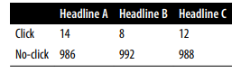
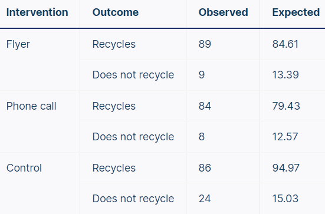
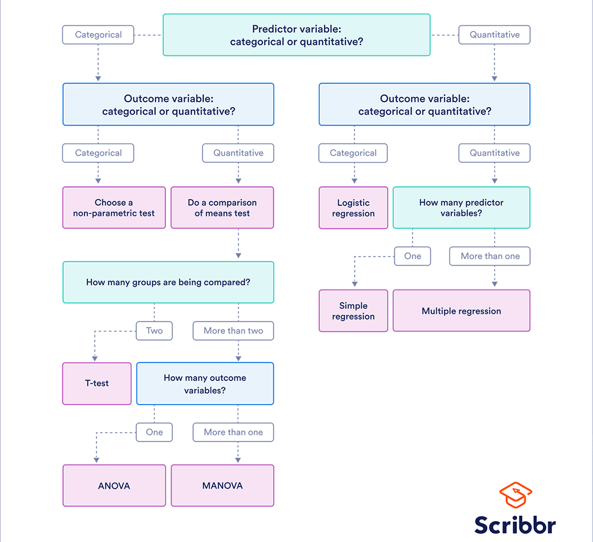

Table of Contents

## Table of contents
Please use the github's interactive navigation. (Too lazy to write/generate TOC)

# Intro
## Central Tendency
It describes where the most of the data lies.Mostly calculated using mean and median. Mean utilizes all values but affected by outliers. Median is not sensitive to the outliers but uses only one/few values. 
## Random Sampling and Sample Bias
A sample is a subset of data from a larger data set called population. 
> Random Sampling is a process in which each member in population has equal chance of being chosen for sample.

If sampling is not random, it will result in sample bias i.e the sample does not represent the population. There might be correlated samples. Also one need to look out for confounding variables. For example, we are trying to understand relation between ice creams and sunburns and conclude that increased ice cream consumption increases sun burns. But in reality there is a confounding variable, temperature which effects both ice creams and sunburns. So data collection is quite important.

> Descriptive statisics are used to summarize and describe the characteristics of a dataset. Measures like mean, median, and standard deviation are examples of descriptive statistics.
>  Inferential statistics are used to draw conclusions about a population based on a sample of data. Techniques like hypothesis testing and confidence intervals are examples of inferential statistics.

Data distribution is the frequency distribution of **individual values** in a data set. Sampling distribution is the frequency distribution of **sample statistic**(mean, median etc) over many samples. People deal with samples beacuase dealing with millions of large populations is not practically ideal.
## Limit Theorems
### Sample Mean
Let $X_1$,.. $X_n$ be a sequence of iid random variables. The sample mean is given by

$$ S_n = {1\\over n}{\sum_{i=1}^n X_i} $$
### Weak Law of Large Numbers
$$ \lim_{n\to\infty} P(|S_n-\mu|>k)=0 $$

As the sample size n approaches infinity, the sample mean **converges in probability** to the true population mean. This means that as the sample size gets larger and larger, the probability that the sample mean deviates from the true population mean by more than k approaches zero.
### Strong Law of Large Numbers
$$ P(\lim_{n\to\infty} S_n = \mu) = 1 $$

As sample size n approaches infinity, the sample mean **converges almost surely** to mean. This provides a theoretical justification for the use of sample means as unbiased estimators of population means.

For example, a coin might land on heads 5 times in a row, but over a much larger n we would expect the proportion of heads to be approximately half of the total flips. Similarly, a casino might experience a loss on any individual game, but over the long run should see a predictable profit over time.
### Central Limit Theorem
It states that if we repeatedly sample a random variable a large number of times, the distribution of the sample mean will approach a normal distribution regardless of the initial distribution of the random variable.

$$ S_n = {{X_1+X2+...X_n}\\over n} \sim N(\mu,{\sigma^2\\over n}) $$

In other terms,

$$ {(S_n - \mu)\\over {\sigma\\over \sqrt(n)}} \sim N(0,1) $$

# Probability Distributions
## Normal Distribution
The well-known bell curve.

$$ f(x) = \frac{1}{\sqrt{2\pi\sigma^2}} \ e^{-\frac{(x-\mu)^2}{2\sigma^2}} $$

* Mean, median and mode are exactly the same.
* Around 68%, 95% and 99.7% of values are within 1,2,3 standard deviations from the mean respectively.
### Z-Distribution/ Standard Normal
Normal distribution with mean 0 and standard deviation 1. We convert normal to standard normal to calculate confidence intervals, perform hypothesis tests etc. The **z-scores** tells us how many standard deviations away from mean each value lies. This is also called **standardization**

$$ z = {x-\mu\\over \sigma} $$

Each z-score is associated with a probability or **p-value** that tells us the likelihood of values below that z-score occurring. This is the area under the curve left or right of that z score.
### T-Distribution/ Student
The t-distribution is a type of normal distribution that is used for smaller sample sizes. It has heavier tails than the normal distribution. As a result, the t-distribution has more probability in the tails and less in the center than the normal distribution. The variance in a t-distribution is estimated based on the degrees of freedom(df) of the data set. A **t-score** is the number of standard deviations from the mean in a t-distribution.
> Degrees of freedom (df) is the number of independent pieces of information used to calculate a statistic. It’s calculated as the sample size minus the number of restrictions. In most cases, df = Sample Size - 1 because in most cases we know mean. If we know n-1 values in a sample, then the last value can be calculated with mean formula which means the last value is not free to vary, it has a restricted value.

As the degrees of freedom increases, the t-distribution will get closer and closer to matching the z-distribution, until they are almost identical (df>30).
### Standardization vs Normalization
Say we have a dataset with `Age` and `Salary` columns. Range of age is usually 0-100 but salary has a bigger range and values. Using them without any feature scaling technique will make salary dominant in distance based algorithms. Two main feature scaling technique are standardization and normalization.

Standardization transforms data to have a mean of zero and a standard deviation of one. It preserves the shape of the distribution of the original data, but it changes the scale and location of the data. So it is used when we know the underlying distribution and highly preferred over normalization as it is robust to outliers. Preferred where gradient descent is used for convergence.

Normalization is used to rescale data to a range of 0 to 1 or -1 to 1. Normalization is often used when the absolute values of the data are less important and we dont know the underlying distributions.

$$ x' = ({2*(x - min)\\over (max - min)}) - 1 $$

## Chi-Square ($X^2$) Distribution
Chi-square (pronounced 'kai-square') is a continuous probability distribution that arises in the context of hypothesis testing and confidence interval estimation for the variance of a normally distributed population. The shape of the distribution is determined by the parameter df, which represents the degrees of freedom. 

Imagine taking a random sample of a standard normal distribution (Z). If you squared all the values in the sample, you would have the chi-square distribution with df = 1. $Χ_2^1 = (Z)^2$

Now imagine taking samples from two standard normal distributions (Z1 and Z2). If each time you sampled a pair of values, you squared them and added them together, you would have the chi-square distribution with df = 2. $Χ_2^2 = (Z_1)^2 + (Z_2)^2$

More generally, if you sample from k independent standard normal distributions and then square and sum the values, you’ll produce a chi-square distribution with k degrees of freedom. 

$$ Χ_k^2 = (Z_1)^2 + (Z_2)^2 + … + (Z_k)^2 $$

* Mean and variance is k and 2k respectively.
* When df is 1 or 2, the distribution looks like 90degress clockwise rotated `J`.
* When df is greater than 2, the distribution is right-skewed normal distribution.
* When df is greater than 90, the distribution looks like normal distribution.

# Sample Statistics
A sample statistic is a numerical measure that summarizes the characteristics of a sample of data. It is calculated from the sample data and is used to estimate the corresponding population parameter. It could be mean, standard deviation, variance, median, mode etc. Sample statistics are subject to sampling variability, which means that different samples of the same size from the same population may produce different sample statistics. This is why we use histograms, boxplots, violin plots, standard errors, confidence intervals and hypothesis testing to quantify the uncertainty in our estimates and make statistical inferences.
## Standard Error
W.K.T standard deviation represents variability of individual data values (in a single sample). To get variability of sampling distribution (over multiple samples), we calculate **standard error**. For a standard deviation of $\sigma$ and sample size of n, SE is given by:

$$ SE = {\sigma\\over \sqrt(n)} $$

## Confidence Intervals
We deal with two different types of data, normally distributed or proportions. Population proportion refers to the proportion or percentage of individuals in a population who have a particular characteristic of interest. For example, if we are interested in the proportion of people in a city who own a car, the population proportion ($p$) would be the percentage of all people in that city who own a car. But again estimating something from all population is not practical so we use sample proportions $\hat{p}$. We could take a random sample of 500 people from the city, and count how many of them own a car. Let's say we find that 300 people in the sample own a car. The sampling proportion is then 300/500 = 0.6, or 60%. This 0.6 also represents mean of proportion. Standard devaition is calculated by $\hat{p}(1-\hat{p})$

Though sampling proportions help with estimating the population proportions, how confident are we about samples? We might be different proportions with different samples. So we try to give a range of values instead of a single value called confidence interval.
> A confidence interval is a range of values that likely contains the true value of a population parameter with a certain degree/percentage of confidence.

In other words, it is the mean of your estimate plus and minus the variation in that estimate. This is the range of values we expect our estimate to fall between if we redo our test, within a certain level of confidence. The level/percentage of confidence tells us the percentage of times we expect to reproduce an estimate between the upper and lower bounds of the confidence interval set by $CL = 1 - \alpha$. If we use $\alpha$ of 0.005, we represent 95% confidence level.

To calculate confidence interval we need test statistics like Z-score, t-scores and sample statistics like mean.

$$ CI = \hat{X} \pm (Z^\*(or)t^\*){\sigma\\over \sqrt(n)} $$

In case of proportions,

$$ CI = \hat{p} \pm ((Z)^\*(or)(t)^\*)\sqrt{\hat{p}(1-\hat{p})\\over n} $$

# Hypothesis Testing
## Test Statistics
A test statistic is a numerical value that is calculated from sample data and used to make a decision about a hypothesis. In hypothesis testing, we start with a null hypothesis, which represents a default assumption about a population parameter, and an alternative hypothesis, which represents an alternative to the null hypothesis. The test statistic is used to determine whether we reject or fail to reject the null hypothesis.
## A/B Testing
An A/B test is an experiment with two groups to establish which of two treatments/products/procedures is superior. A/B test will have two versions of products one is a regular version without any change called *control group* and other version is with new update/experiment called *treatment group*. How we measure the effect of the update is with test statistic.
## Hypothesis Tests
Hypothesis/significance tests purpose is to help us learn whether random chance is responsible for an observed effect. A/B testing is one type of a hypothesis testing. We can get easily fooled by random chance. When we see a coin landing on Heads for straight 6 times will make us think that coin is baised but in reality it might be pure random chance. A hypothesis test is further analysis of A/B test to assess whether random chance is a resonable explanation for the observed difference between groups A and B. 

The main logic in these tests is we start with an hypothesis that difference between A and B is caused by random chance. This is our *null hypothesis*. Our hope then is that to prove this null hypothesis wrong. We will have an *alternative hypothesis* in contradictory to null. For example: Null could be No difference between A and B, then Alternative would be A is different from B.

Hypothesis test are either **one-tailed ot two-tailed** tests. One tailed means, we know the result will go in only one direction. For example, null: A is better and alternativev: B is better. We only check if B is better. In two-tails, our alternative is both B is better and B is worse. We want to know in both directions. In general, many prefer two-tails as we might not know which direction to choose in one tail.
## Statistical Significance and p-Values
If the result of the experiment is beyond the random chance, then the result is statistically significant.  **p-value** of an experiment is the probability of obtaining a result more than an observed result in other words it tells us the probability of the getting a result due to chance. Which means lesser thep value, influence of chance is less thus rejecting null hypothesis. The threshold of p-value is called **alpha-value**. Say we set an alpha value of 0.05, we are saying that we are willing to accept a 5% chance of making a **Type I error** (rejecting the null hypothesis when it is actually true). If the calculated p-value from the test is smaller than the alpha value, we reject the null hypothesis, since the observed result is unlikely to have occurred by chance alone at the chosen significance level. If the calculated p-value is larger than the alpha value, we fail to reject the null hypothesis, since the observed result could plausibly have occurred by chance, and we do not have sufficient evidence to reject it.
## False Discovery Rates
> Torture the data long enough, and it will confess.

Our ML brains think that more data means better results. That's not always true atleast not in hypothesis testing. Say we do an experiment from a sample size, and we get a p-value of more than 0.05 which means we couldn't reject null. We continue doing the experiment and somewhere we get a p-value less than 0.05 and we reject null. Hold your horses! Remember there is a thing called alpha with a value of 0.05 saying there is 5% chance of making a Type I error... This instance can be one such error. So multiple testing can lead to biased decisions. But sometimes we might have to do multiple testing is scenarios like there are more than 2 versions and we need to test them etc. We can use False Discovery Rate (FDR) to help us. We just have to do many tests and report all p values to FDR system, then we get increased p-values from the system thus decreasing the chances of Type I errors. 

In general two different versions there is high chance of rejecting null hypothesis. If we plot histograms of p-values for both, our histogram looks like right skewed as most of the sample's p-values will likely be less than 0.05. But we do the same for similar versions, our histogram looks uniform. This is a an eye-ball method of finding false values.

Mathematically, we sort in ascending order all p-values and give them rank from 1 to n (number of samples). We start from the nth rank and we set the adjusted value as $min(Prev.adjusted p-value, p-val*{n\\over rank})$.

## Statistical Power
Statistical power, or sensitivity, is the likelihood of a significance test detecting an effect when there actually is one. The more power means the more probability that we can avoid **Type II error** (accepting null hypothesis when it is not the case). 

Power is usually set at 80%. This means that we set a 80% probability of correctly rejecting null hypothesis. If we don’t ensure sufficient power, our study may not be able to detect a true effect at all. On the flip side, too much power means our tests are highly sensitive to true effects, including very small ones. This may lead to finding statistically significant results with very little usefulness in the real world. 
### How to do Power Analysis
Power Analysis is used to know **minimum sample size** to chose for a test. We start by setting a power value usually 0.8. Then we determine threshold for significane (alpha) usually set to 0.5. Next is to find an **effect size** which is the magnitude of a difference between groups or a relationship between variables. Say for example, we need to do a test on drug A and drug B. We get the distributions of both drugs (usually a normal distribution). To know how different these two drugs are we can see how different respective distributions are. More overlap in distributions implies more similarity and vice-versa. Effect size is commonly determined using estimated difference in means divided by pooled estimated standard deviations. We calculate sample size using an online calculator. More overlap/ small effect size needs bigger sample size and vice -versa. 
## t-Tests
All significance tests require that we specify a test statistic to measure the effect we are interested in. The point of tests is to find if two versions/models are different from each other. Each test may choose to find difference in means/variance/frequency etc to find difference in the distributions of versions/models.

We use t-tests to determine whether the **means of two groups** are significantly different from each other. Our test stastistic used is t-value. The t-value is calculated by taking the difference between the means of the two groups and dividing it by the standard error of the difference between the means. Most commonly used t-tests are
* Paired t-test

It is used when we want to compare the means of the groups coming from a single population (e.g., measuring before and after an experimental treatment). 

$$ t = {x1 -x2\\over {s\\over sqrt(n)}} $$

where x1 and x2 are the means of the paired samples, s is the standard deviation of the differences between the pairs, and n is the number of pairs. The degrees of freedom for the paired t-test are (n-1).
* Two-Sample t-test

It is used when we want to compare the means of two independent groups. 

$$ t = {x1-x2\\over {s*\sqrt{{1\\over n1} + {1\\over n2}}}} $$

x1 and x2 are the means of the two groups, s is the pooled standard deviation of the two groups, n1 and n2 are the sample sizes of the two groups. The degrees of freedom for the two-sample t-test are (n1 + n2 - 2).

We then calculate p-value associated with t-value to get a conclusion on hypothesis.
## ANOVA
Suppose that, instead of an A/B test, we had a comparison of multiple groups, say A/B/C/D, each with numeric data. The statistical procedure that tests for a statistically significant difference among the **means of the groups** is called analysis of variance, or ANOVA. A one-way ANOVA uses one independent variable, while a two-way ANOVA uses two independent variables.
### One-way ANOVA
We use a one-way ANOVA when we have data about one categorical independent variable and one quantitative dependent variable. The independent variable should have at least three levels (i.e. at least three different groups or categories A,B,C). 
* Independent variable is social media use, and we assign groups to low, medium, and high levels of social media use to find out if there is a difference in hours of sleep per night (dependent quantitative).
* Independent variable is brand of soda, and we collect data on Coke, Pepsi, Sprite, and Fanta to find out if there is a difference in the price per 100ml (dependent quantitative).
* Independent variable is type of fertilizer, and you treat crop fields with mixtures 1, 2 and 3 to find out if there is a difference in crop yield (dependent quantitative).

The null is there is no difference between group means. Alternative is at least one group differs significantly from the overall mean of the dependent variable. Since we have more than two groups, we use a test statistic called **F-statistic**. The F statistic is based on the ratio of the variance between the group means to the variance within the groups. The higher this ratio, the more statistically significant the result. 
### Two-way ANOVA
It is used to estimate how the mean of a quantitative variable changes according to the levels of two categorical variables.
* Effect of two different teaching methods (A and B) (independent variable 1) and two different class sizes (small and large) (independent variable 2) on students' test scores (dependent quantitative).
* Effect of three fertilizer types and two levels of planting mentods on yeild per acre.

For F-statistic, we now have another extra calculations of interactions like group 1 and group2 interaction variance (A*B). Thus we can even have alternative hypotheis of whether interactions of groups has an effect on the dependent variable.
## Chi-Square Test
It is a statistical test for categorical data. Instead of means or variance. chi-square test uses **frequency(count)** of the data to determine whether there is a significant association between two categorical variables. It is a common non-parametric test as it doesn't assume data to be normal distribution. If we need to test a hypothesis about the distribution of a categorical variable we’ll need to use a chi-square test or another nonparametric test. Chi-square test uses *chi-square* as the test statistic.

$$ X^2 = \sum{(O-E)^2\\over E} $$

where $O$ is observed frequency and $E$ is the expected frequency. 
Chi-square uses contingency table to show the number of observations in each combination of groups.

There are two types of chi-square tests: 
### Chi-square goodness of fit test 
It is used to test whether the frequency distribution of a categorical variable is different from our expectations. Often, but not always, the expectation is that the categories will have equal proportions. Ex: null is all three headlines share the same click rate, alternative is all three headlines share different click rate. 

Example: (by [Shaun Turney](https://www.scribbr.com/author/shaunt/))

Problem Statement: Help a dog food company to test three new dog food flavors. (only one categorical variable in this case).

We start with taking a random sample of 75 dogs (to get best sample size, use power analysis). We offer each dog a choice between three flavors(categorical varaible). Our null hypothesis is that dog population chooses the three flavors in equal proportions. So our expected values(frequency/counts) for each flavor would be 25,25 and 25. Alternative hypothesis is The dog population does not choose the three flavors in equal proportions. We do this by getting experimental data and test how well it's distribution **fits** to the expected data distribution. If it fits good, we cant reject the null hypothesis. If it doesn't fit, then find which is the most different category. Our contingency table looks like:

|Flavor|Observed|Expected|
|---|--|--|
|Seattle Crunch|22|25|
|Austin Punch|30|25|
|Jersey Munch|23|25|

One might think that, as Austin Punch has more observed values, we should prefer that flavor. But it might be just a random chance from our sample. So we calculate test statistic, chi-square using formula and we get $X^2 = 1.52$. Does this value represents high or low fit? We use crirtical chi-square value for comparison. We have a [chi-square critical value table](https://www.scribbr.com/statistics/chi-square-distribution-table/) which have critical values for each degrees of freedom and each significance value. In our case $df = Number of groups-1 = 2$ and common significance value(alpha) of 0.05. Looking up in the table we have critical value of 5.99 which is greater than our 1.52. Thus the difference between the observed and expected distributions is not statistically significant. 
### Chi-square test of independence 

It is used to test whether two categorical variables are related to each other. If two variables are independent (unrelated), the probability of belonging to a certain group of one variable isn’t affected by the other variable. Ex: null is the proportion of people who are left-handed is the same for Americans and Canadians and alternative is the proportion of people who are left-handed differs between nationalities.

Example: (by [Shaun Turney](https://www.scribbr.com/author/shaunt/))

Problem Statement: Help a city decide a flyer or a phone call is effective to promote a recycle campaign.

We satrt with randomly selecting 300 households and randomly assigning them to the flyer, phone call, or control group (no flyer/phonecall). Our null hypothesis is The proportion of households that recycle is the same for all interventions. Alternative hypothesis is The proportion of households that recycle is not the same for all interventions. We calculate Observed and expected frequencies (In image: observed above, expected below)

Our contigency table looks like:

Calculating the test static using our formula gives, $X^2=9.79$. We calculate degrees of freedom by $(no.of category 1 groups - 1)*(no.of category 2 groups - 1) = (3-1)*(2-1) = 2$ and $\alpha=0.05$. Looking up in chi-square critical value table gives critical value = 5.99. As $X^2$ is greater than critical value, we reject the null hypothesis and conclude interventions have an effect on whether households choose to recycle. 
## Choosing a Statistical Test

# Statistical Paradoxes
## Simpsons Paradox
Simpson's Paradox is a statistical phenomenon where a trend or association observed within different subgroups of data is reversed or disappears when the subgroups are combined. In other words, the direction of a relationship between two variables can be misleading when the data is aggregated or grouped. Let's consider an example to understand Simpson's Paradox better:

Suppose a university is evaluating the admission process for two departments: the Computer Science department and the History department. The university wants to determine if one department has a higher admission rate than the other.
In a particular year, the admission data for the two departments is as follows:

Computer Science Department:

* Male applicants: 800 admitted out of 1,000 (80% admission rate)
* Female applicants: 200 admitted out of 1,500 (13.3% admission rate)

History Department:

* Male applicants: 500 admitted out of 1,000 (50% admission rate)
* Female applicants: 500 admitted out of 1,000 (50% admission rate)

If we analyze the data separately for each department, it appears that the Computer Science department has a higher admission rate for both males (80%) and females (13.3%) compared to the History department's admission rate for both males (50%) and females (50%). However, when we combine the data for both departments and look at the overall admission rates, a surprising result emerges:

Combined Data:

* Male applicants: 1,300 admitted out of 2,000 (65% admission rate)
* Female applicants: 700 admitted out of 2,500 (28% admission rate)

Here's where the paradox occurs: Even though the admission rates for each department favored males over females, the overall admission rate shows that females (28%) had a lower admission rate compared to males (65%). The paradox arises due to the difference in the composition or proportions of males and females in each department. In this example, the Computer Science department had a larger proportion of male applicants (2,000 out of 2,500) compared to the History department (1,000 out of 2,000). And since the admission rates within each department favored males, the overall admission rate appeared to favor males as well, despite the fact that females had a higher admission rate within each department.

This example demonstrates how Simpson's Paradox can occur when the underlying composition or distribution of variables within subgroups affects the overall relationship observed when the data is aggregated. In most cases considering weighted averages avoids this paradox or find any confounding variables (variables outside of our dataset that are affecting our outcome).  
## Gamblers Fallacy
The Gambler's Fallacy is a cognitive bias that occurs when an individual mistakenly believes that past independent events in a random sequence will influence future events. It is the belief that the likelihood of a particular outcome increases or decreases based on previous outcomes, despite the events being statistically independent. For example, if an unbiased coin is tossed and you get heads 9 out of 10 times then you might expect next trial will give you a head but the coin is unbiased so the probability is still 50-50. Taking over a large sample space like 100 trails, the probability should be close to 50-50. 
## Berksons Paradox
Berkson's Paradox, named after the American mathematician Joseph L. Berkson, is a statistical phenomenon that can arise when studying the relationship between two variables. It occurs when there is an artificial or non-representative association between variables due to the sampling or selection process.

The paradox can be explained with an example:

Suppose a hospital is conducting a study to investigate the relationship between diabetes and high blood pressure. The hospital collects data from two sources: patients who visit the diabetes clinic and patients admitted to the hospital for high blood pressure.

In the diabetes clinic: 60% of patients have diabetes.
40% of patients have high blood pressure.
In the hospital for high blood pressure: 10% of patients have diabetes.
90% of patients have high blood pressure. If we look at each source individually, we observe an inverse relationship: a higher proportion of patients with diabetes in the diabetes clinic and a higher proportion of patients with high blood pressure in the hospital for high blood pressure.

However, if we combine the data from both sources, we get the following overall proportions: 30% of patients have diabetes.
70% of patients have high blood pressure.
This result seems to suggest a negative association between diabetes and high blood pressure, which is contrary to what is generally known (diabetes is often associated with an increased risk of high blood pressure).

The paradox arises because the sampling process created an artificial association. Patients who visit the diabetes clinic are more likely to have diabetes and less likely to have high blood pressure compared to the general population. On the other hand, patients admitted to the hospital for high blood pressure are more likely to have high blood pressure and less likely to have diabetes. When the two groups are combined, the non-representative sampling introduces the paradoxical relationship. Berkson's Paradox reminds us to be cautious when interpreting associations between variables, especially if the data collection process involves selective sampling. It highlights the importance of considering the sampling biases and understanding the context to avoid drawing erroneous conclusions based on artificially created relationships.
# References
The information is pulled from various sources on the internet. Major sources are:
1. [Practical Statistics for Data Scientists](https://www.oreilly.com/library/view/practical-statistics-for/9781491952955/)
2. [Scibbr](https://www.scribbr.com/statistics/)
3. [Ace the Data Science Interview](https://www.acethedatascienceinterview.com/)
4. ChatGPT :)
